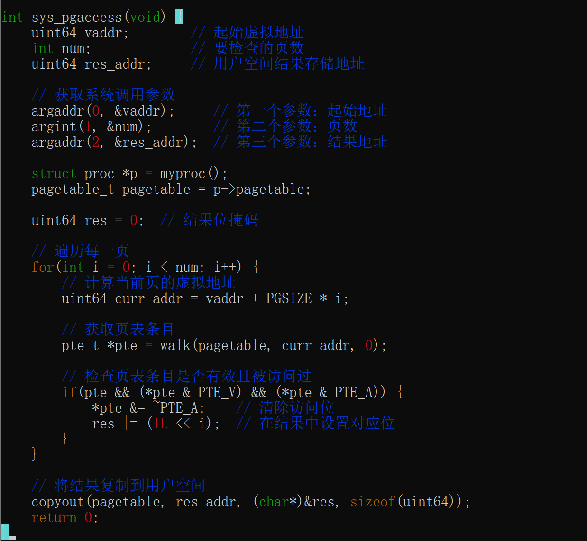
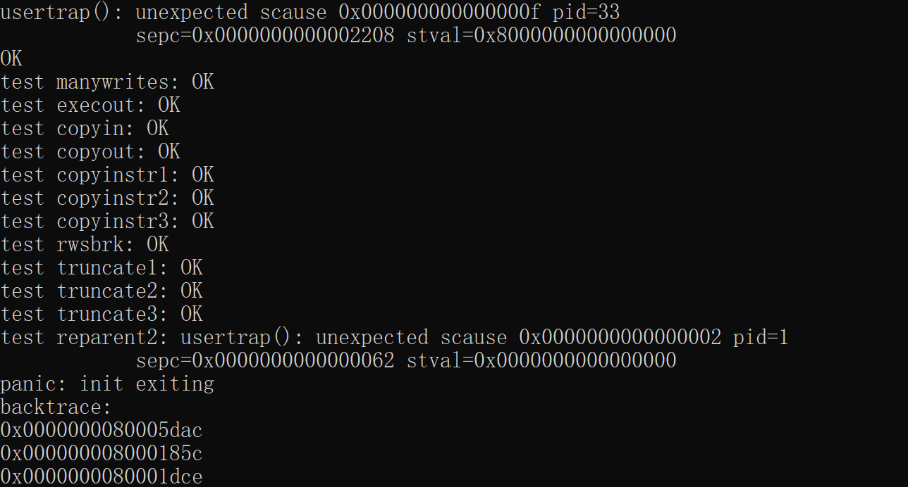
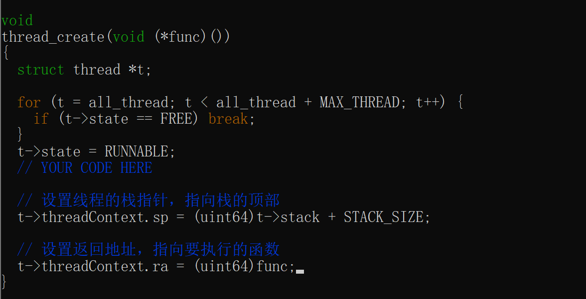
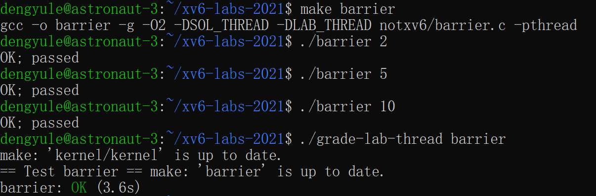
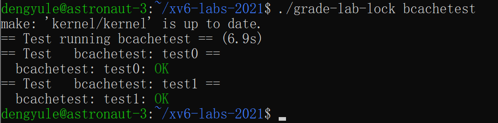
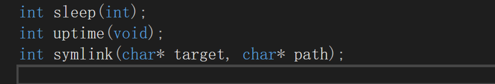
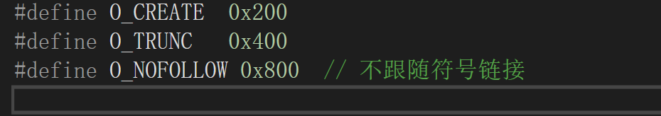
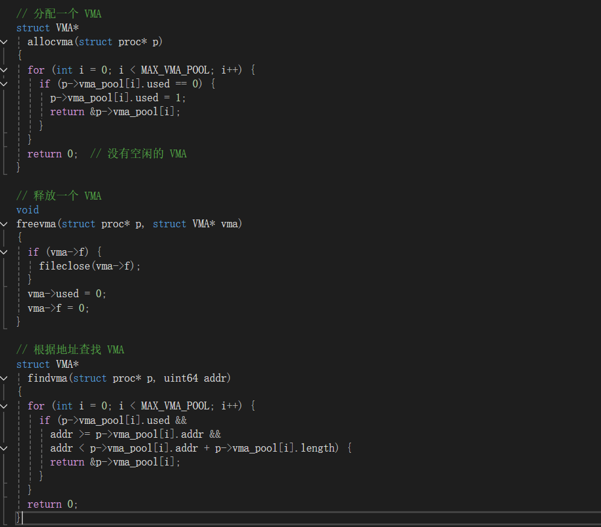

# Xv6 - 简单的类 Unix 教学操作系统

**学号**: 2351273  
**姓名**: 邓语乐  
**时间**: 2025 年暑期

**Git 仓库**: [项目地址] https://github.com/taaasul/Xv6_Lab_Report_2021

---

## 目录

- [Tools & Guidance](#tools--guidance)
- [Lab1: Xv6 and Unix utilities](#lab1-xv6-and-unix-utilities)
- [Lab2: System calls](#lab2-system-calls)
- [Lab3: Page tables](#lab3-page-tables)
- [Lab4: Traps](#lab4-traps)
- [Lab5: Copy on-write](#lab5-copy-on-write)
- [Lab6: Multithreading](#lab6-multithreading)
- [Lab7: Network driver](#lab7-network-driver)
- [Lab8: Lock](#lab8-lock)
- [Lab9: File system](#lab9-file-system)
- [Lab10: Mmap](#lab10-mmap)

---

## Tools & Guidance

### Tools

#### 安装 WSL 并启用虚拟化

1. **下载并安装适用于 Linux 的 Windows 子系统**

   - 从 Microsoft Store 添加 Ubuntu 20.04
   - 成功后应该能够启动 Ubuntu 并与机器交互
   - 在 Windows 中，可以访问 `\\wsl$` 目录下的所有 WSL 文件
   - Ubuntu 20.04 的主目录应该在 `\\wsl$\Ubuntu-20.04\home`

2. **检查 WSL2 要求**

   - 确认 Windows 版本是否符合要求
   - 按下 `Win+R` 打开运行窗口，输入 `winver` 并检查 Windows 版本
   - 确保版本号大于 1903
     

3. **启用虚拟化命令**
   以管理员的方式运行 Powershell 并在命令行中输入以下内容：

   ```powershell
   dism.exe /online /enable-feature /featurename:VirtualMachinePlatform /all /norestart
   ```

   

4. **下载 X64 的 WSL2 Linux 内核升级包并安装**
   以管理员的方式运行 Powershell 并在命令行中输入以下内容：

   ```powershell
   wsl --set-default-version 2
   ```

   

5. **安装 Ubuntu**
   在命令提示符（CMD）中，以管理员的方式运行，输入以下命令来安装 Ubuntu 20.04 LTS：
   ```cmd
   C:\Windows\System32>wsl --install -d Ubuntu-20.04
   ```
   

#### 软件源更新和环境准备

启动 Ubuntu，安装本项目所需的所有软件，运行：

```bash
$ sudo apt-get update && sudo apt-get upgrade
$ sudo apt-get install git build-essential gdb-multiarch qemu-system-misc gcc-riscv64-linux-gnu binutils-riscv64-linux-gnu
```


#### 测试安装

```bash
$ qemu-system-riscv64 --version
$ riscv64-linux-gnu-gcc --version
```


#### 编译内核

下载 xv6 内核源码：

```bash
$ git clone https://github.com/mit-pdos/xv6-riscv.git
```


更新镜像源：

```bash
$ sudo nano /etc/apt/sources.list
$ sudo apt-get update
```


### Guidance

#### 理解 C 语言和指针

确保你理解 C 语言和指针。Kernighan 和 Ritchie 的《C 程序设计语言（第二版）》是 C 语言的简洁描述。一些有用的指针练习在这里。

**一些指针的常见习语特别值得记住：**

- 如果 `int *p = (int*)100`，那么 `(int)p + 1` 和 `(int)(p + 1)` 是不同的数字：前者是 101，而后者是 104
- `p[i]` 定义为 `*(p+i)`，指的是 p 指向的内存中的第 i 个对象
- `&p[i]` 与 `(p+i)` 相同，生成 p 指向的内存中第 i 个对象的地址

#### 检查进度

如果你的练习部分工作，请通过提交代码来检查你的进度。如果稍后出现问题，可以回滚到检查点并以较小的步骤前进。

#### 测试失败

如果测试失败，请确保你了解为什么代码失败。插入打印语句直到你了解发生了什么。

#### 使用 GDB 调试

要使用 gdb 调试 xv6，请在一个窗口中运行 `make qemu-gdb`，在另一个窗口中运行 `gdb`（或 `riscv64-linux-gnu-gdb`），设置断点，然后输入 `c`（继续），xv6 将运行直到命中断点。

#### 内核崩溃

如果内核崩溃，它将打印一条错误消息，列出崩溃时程序计数器的值；你可以搜索 `kernel.asm` 以查看程序计数器在崩溃时所在的函数。

#### 内核挂起

如果内核挂起（例如，由于死锁）或无法继续执行（例如，由于执行内核指令时的页面错误），你可以使用 gdb 找出挂起的地方。

#### QEMU 监视器

QEMU 有一个"监视器"，可以让你查询仿真机器的状态。你可以通过输入 `control-a c`（"c"表示控制台）来访问它。一个特别有用的监视器命令是 `info mem`，用于打印页表。

---

## Lab1: Xv6 and Unix utilities

本实验用于熟悉 xv6 及其系统调用。

### Boot xv6

1. **获取用于实验的 xv6 源代码并检出 util 分支:**

   ```bash
   $ git clone git://g.csail.mit.edu/xv6-labs-2021
   $ cd xv6-labs-2021
   $ git checkout util
   ```

   
   

2. **构建并运行 Xv6:**

   ```bash
   make qemu
   ```

   
   

如果在提示符下输入 `ls`，输出应类似于以下内容：


这些是 mkfs 在初始文件系统中包含的文件；大多数是可以运行的程序。刚才运行的其中一个程序是 ls。

xv6 没有 ps 命令，但如果输入 Ctrl+p，内核将打印每个进程的信息。如果现在尝试，会看到两行输出：


一行是 init，另一行是 sh。

要退出 qemu，请输入：`Ctrl-a x`。


### Sleep

#### 实验目的

1. 实现 UNIX 程序 `sleep` 以用于 xv6
2. 实现该 `sleep` 程序应暂停指定的用户数量的时间片
3. 解决方案应在文件 `user/sleep.c` 中

#### 实验步骤

**前期准备**

在开始编码之前，阅读 Xv6-book 的第 1 章，并查看 `user/` 目录中的其他程序。

**编码步骤**

1. **创建 sleep.c 文件**

   在 user 目录下，创建一个名为 `sleep.c` 的文件。

2. **编写 sleep.c 程序**

   ```c
   #include "kernel/types.h"
   #include "kernel/stat.h"
   #include "user/user.h"

   int main(int argc, char *argv[]) {
       if (argc != 2) {
           printf("Usage: sleep <ticks>\n");
           exit(1);
       }

       int ticks = atoi(argv[1]);
       if (ticks < 0) {
           printf("Error: ticks must be a positive integer\n");
           exit(1);
       }

       sleep(ticks);
       exit(0);
   }
   ```

   

3. **编辑 Makefile**

   将编写好的 sleep 程序添加到 Makefile 的 UPROGS 中：

   ```makefile
   UPROGS=\
   	$U/_cat\
   	$U/_echo\
   	$U/_forktest\
   	$U/_grep\
   	$U/_init\
   	$U/_kill\
   	$U/_ln\
   	$U/_ls\
   	$U/_mkdir\
   	$U/_rm\
   	$U/_sh\
   	$U/_stressfs\
   	$U/_usertests\
   	$U/_grind\
   	$U/_wc\
   	$U/_zombie\
   	$U/_sleep\
   ```

   

4. **编译并测试程序**

   ```bash
   make qemu
   ```

5. **单元测试**

   ```bash
   ./grade-lab-util sleep
   ```

#### 实验结果

从 xv6 shell 运行程序：

```bash
$ make qemu
...
init: starting sh
$ sleep 10
（一段时间内无事发生）
$
```

#### 文件操作参考

在命令行中，可以运行以下命令来打开文件并查看其内容：

1. **使用 Vim 编辑器：**

   ```bash
   $ vim user/echo.c
   ```

   在 Vim 编辑器中打开文件后，要退出并返回终端命令行界面，可以按照以下步骤操作：

   - 如果您处于编辑模式（Insert Mode），请按下 `Esc` 键，以确保切换到正常模式（Normal Mode）
   - 在正常模式下，输入冒号（`:`）字符，会在命令行底部出现一个冒号提示符
   - 输入 `:q`，然后按下回车键，执行退出命令
   - 如果您对文件进行了修改并希望保存更改，输入 `:wq` 以保存更改
     

2. **使用 cat 命令：**

   ```bash
   cat user/echo.c
   ```

   该命令会将文件的内容直接输出到终端。

3. **使用 less 命令：**
   ```bash
   less user/echo.c
   ```
   less 命令是一个分页查看器，用于逐页查看文件内容（使用空格键向下翻页，使用 `b` 键向上翻页，按下 `q` 键退出）。

#### 内核参考

通过以下文件了解 sleep 系统调用的实现：

1. **kernel/sysproc.c 中的 sys_sleep** - 获取实现 sleep 系统调用的 xv6 内核代码
2. **user/user.h** - 获取可从用户程序调用 sleep 的 C 语言定义
3. **user/usys.S** - 获取从用户代码跳转到内核以实现 sleep 的汇编代码

#### 实验结果

从 xv6 shell 运行程序：


```bash
$ make qemu
...
init: starting sh


$ sleep 10
（一段时间内无事发生）
$

```

如果程序在上述情况下暂停，则解决方案是正确的。运行测试以查看是否确实通过了 sleep 测试。

#### 分析讨论

在本实验中，成功实现了 xv6 操作系统下的 sleep 程序。实验的关键步骤包括正确解析命令行参数、调用 xv6 内核提供的 sleep 系统调用，以及处理异常输入。

通过实现 sleep 程序，我深入理解了 Unix 系统调用的基本机制。这个看似简单的程序实际上涉及了系统编程的多个重要概念，包括命令行参数解析、系统调用接口使用以及错误处理机制。

掌握了 argc 和 argv 参数的处理方法，学会了使用 atoi 函数进行字符串到整数的安全转换。通过调用内核提供的 sleep 系统调用，理解了用户态程序如何请求内核服务来实现进程休眠。程序中的错误检查逻辑体现了健壮系统程序的编写原则，包括参数数量验证和输入有效性检查。

实验让我们认识到操作系统内核和用户程序之间的清晰分工。用户程序负责参数解析和输入验证，而实际的时间管理和进程调度由内核完成。这种分层设计是现代操作系统的基本架构原则，确保了系统的安全性和稳定性。

### Pingpong

#### 实验目的

1. 编写一个程序，使用 UNIX 系统调用通过一对管道在两个进程之间传递一个字节
2. 父进程应向子进程发送一个字节；子进程应打印 `<pid>: received ping`
3. 然后通过管道将字节写回父进程并退出；父进程应从子进程读取字节，打印 `<pid>: received pong`，然后退出
   

#### 实验步骤

1. **编写 pingpong 程序：**

```c
#include "kernel/types.h"
#include "user/user.h"
#include "kernel/fcntl.h"

int main() {
    int p[2], q[2];
    char buf[1];
    int pid;

    // 创建两个管道
    pipe(p);
    pipe(q);

    // 创建子进程
    if ((pid = fork()) < 0) {
        fprintf(2, "fork error\n");
        exit(1);
    }

    if (pid == 0) { // 子进程
        // 从父进程读取字节
        read(p[0], buf, 1);
        printf("%d: received ping\n", getpid());
        // 将字节写回父进程
        write(q[1], buf, 1);
        // 退出子进程
        exit(0);
    } else { // 父进程
        // 向子进程写入字节
        write(p[1], "x", 1);
        // 从子进程读取字节
        read(q[0], buf, 1);
        printf("%d: received pong\n", getpid());
        // 等待子进程退出
        wait(0);
    }

    exit(0);
}
```


2. **更新 Makefile：**
   在 Makefile 中找到 UPROGS 变量的定义，并添加 `$U/_pingpong\`
   

3. **编译并运行：**
   ```bash
   $ make qemu
   $ pingpong
   ```
   

#### 实验结果

```
4: received ping
3: received pong
```

#### 分析讨论

Pingpong 程序展示了 Unix 系统中管道作为进程间通信工具的强大功能。通过创建两个独立的管道，实现了父子进程之间的双向通信，这是理解 Unix IPC 机制的重要起点。程序演示了如何使用 pipe 系统调用创建通信通道，以及如何在不同进程中正确关闭不需要的文件描述符。

实验中的进程同步是通过管道的阻塞特性自然实现的。当父进程向管道写入数据后，子进程能够立即读取；反之，当子进程向返回管道写入数据时，父进程会阻塞等待直到数据可用。这种同步机制避免了复杂的锁机制，体现了 Unix 系统设计的优雅性。

程序中 fork、pipe、read、write 和 wait 系统调用的协调使用展示了多进程程序的典型结构。特别是 wait 系统调用的使用，确保了父进程等待子进程完成，避免了僵尸进程的产生，这是系统编程中进程管理的重要概念。

### Primes

#### 实验目的

1. 编写一个使用管道实现的并发版本的素数筛选算法
2. 使用管道和 fork 来建立管道
3. 第一个进程将数字 2 到 35 送入管道

#### 实验步骤

1. **创建源文件：**

```c
#include "kernel/types.h"
#include "user/user.h"

void filter(int readfd) {
    int prime;
    if (read(readfd, &prime, sizeof(prime)) == 0) {
        close(readfd);
        return;
    }

    printf("prime %d\n", prime);

    int p[2];
    pipe(p);

    if (fork() == 0) { // 子进程
        close(p[1]);
        filter(p[0]);
        close(p[0]);
    } else {
        close(p[0]);
        int num;
        while (read(readfd, &num, sizeof(num)) > 0) {
            if (num % prime != 0) {
                write(p[1], &num, sizeof(num));
            }
        }
        close(p[1]);
        close(readfd);
        wait(0);
    }
}

int main(int argc, char *argv[]) {
    int p[2];
    pipe(p);

    if (fork() == 0) { // 子进程
        close(p[1]);
        filter(p[0]);
        close(p[0]);
    } else {
        close(p[0]);
        for (int i = 2; i <= 35; i++) {
            write(p[1], &i, sizeof(i));
        }
        close(p[1]);
        wait(0);
    }

    exit(0);
}
```


2. **添加到 Makefile：** 将程序以 `$U/_primes` 的形式添加到 Makefile 的 UPROGS 中

#### 实验结果

```bash
$ primes
prime 2
prime 3
prime 5
prime 7
prime 11
prime 13
prime 17
prime 19
prime 23
prime 29
prime 31
```


#### 分析讨论

本实验采用了 Doug McIlroy 提出的基于管道的并发素数筛选算法，通过进程间通信实现数据传递与处理。虽然代码结构清晰，但资源消耗较大，每个素数的筛选都需要创建新的进程和管道。
Primes 程序实现了 Doug McIlroy 提出的基于管道的并发素数筛选算法，这是并发编程中的经典例子。算法的核心思想是将筛选过程分解为多个独立的进程，每个进程负责过滤特定素数的倍数，体现了分而治之的算法设计思想。
程序使用递归的方式创建进程链，每个进程都承担着双重角色：接收上一级的数据进行过滤，同时为下一级创建新的进程和管道。这种递归结构虽然消耗较多系统资源，但逻辑清晰，充分展示了 Unix 系统的进程创建能力。
通过管道连接的多个进程形成了一个数据处理流水线，每个进程对数据进行特定的变换后传递给下一个进程。这种流式处理模式在 Unix 系统中广泛应用，是函数式编程思想在系统级别的体现，为现代大数据处理系统提供了设计灵感。

### Find

#### 实验目的

1. 编写一个简单版本的 UNIX 查找程序
2. 查找目录树中带有特定名称的所有文件
3. 解决方案应放在 `user/find.c` 文件中

#### 实验步骤

1. **查看 user/ls.c** 以了解如何读取目录

2. **创建 find.c 文件：**

```c
#include "kernel/types.h"
#include "kernel/stat.h"
#include "user/user.h"
#include "kernel/fs.h"

char *fmtname(char *path) {
    static char buf[DIRSIZ + 1];
    char *p;

    // 找到最后一个斜杠之后的部分
    for (p = path + strlen(path); p >= path && *p != '/'; p--);
    p++;

    // 返回最后一个斜杠之后的部分
    if (strlen(p) >= DIRSIZ)
        return p;
    memmove(buf, p, strlen(p));
    memset(buf + strlen(p), 0, sizeof(buf) - strlen(p));
    return buf;
}

void find(char *path, char *target) {
    char buf[512], *p;
    int fd;
    struct dirent de;
    struct stat st;

    // 打开路径
    if ((fd = open(path, 0)) < 0) {
        fprintf(2, "find: cannot open %s\n", path);
        return;
    }

    // 获取文件状态
    if (fstat(fd, &st) < 0) {
        fprintf(2, "find: cannot stat %s\n", path);
        close(fd);
        return;
    }

    switch (st.type) {
    case T_FILE:
        if (strcmp(fmtname(path), target) == 0) {
            printf("%s\n", path);
        }
        break;

    case T_DIR:
        if (strlen(path) + 1 + DIRSIZ + 1 > sizeof(buf)) {
            printf("find: path too long\n");
            break;
        }
        strcpy(buf, path);
        p = buf + strlen(buf);
        *p++ = '/';
        while (read(fd, &de, sizeof(de)) == sizeof(de)) {
            if (de.inum == 0)
                continue;
            memmove(p, de.name, DIRSIZ);
            p[DIRSIZ] = 0;
            if (strcmp(de.name, ".") == 0 || strcmp(de.name, "..") == 0)
                continue;
            find(buf, target);
        }
        break;
    }
    close(fd);
}

int main(int argc, char *argv[]) {
    if (argc < 3) {
        fprintf(2, "Usage: find <path> <filename>\n");
        exit(1);
    }

    find(argv[1], argv[2]);
    exit(0);
}
```


3. **更新 Makefile：** 在 Makefile 中将 find 程序添加到 UPROGS 中
   
   

#### 实验结果

```bash
$ echo > b
$ mkdir a
$ echo > a/b
$ find . b
./b
./a/b
```


#### 分析讨论

通过这次实验，我们实现了一个简单的 find 命令，该命令能递归遍历目录树并查找目标文件。
Find 程序实现了深度优先的目录树遍历算法，这是文件系统操作中的基本技能。程序能够递归地访问目录中的每个文件和子目录，体现了树状数据结构的遍历方法在实际系统中的应用。
通过使用 stat、fstat、open、read 等系统调用，程序展示了如何与 Unix 文件系统进行交互。特别是 dirent 结构体的使用，让我们理解了目录在文件系统中的内部表示方式，以及如何程序化地读取目录内容。
程序中的路径拼接和文件名提取功能展示了系统编程中字符串处理的重要性。正确处理路径分隔符、避免缓冲区溢出、处理特殊目录项（如"."和".."）等细节体现了系统程序开发中需要考虑的各种边界情况。

### Xargs

#### 实验目的

1. 编写一个简单版的 UNIX xargs 程序
2. 从标准输入读取每一行，并将行作为参数传递给命令执行
3. 代码位于文件 `user/xargs.c` 中

#### 实验步骤

1. **创建 xargs.c 文件：**

```c
#include "kernel/types.h"
#include "kernel/stat.h"
#include "user/user.h"
#include "kernel/param.h"

#define MAXLEN 32

int main(int argc, char *argv[]) {
    char *path = "echo";
    char buf[MAXLEN * MAXARG] = {0}, *p;
    char *params[MAXARG];
    int paramIdx = 0;
    int i;
    int len;

    // 读取原有参数
    if (argc > 1) {
        if (argc + 1 > MAXARG) {
            fprintf(2, "xargs: too many args\n");
            exit(1);
        }
        path = argv[1];
        for (i = 1; i < argc; ++i) {
            params[paramIdx++] = argv[i];
        }
    } else {
        params[paramIdx++] = path;
    }

    p = buf;
    while (1) {
        // 读取字符直到结束或遇到回车
        while (1) {
            len = read(0, p, 1);
            if (len == 0 || *p == '\n') {
                break;
            }
            ++p;
        }
        *p = 0;

        // 直接将其作为一个参数
        params[paramIdx] = buf;

        // 创建子进程执行
        if (fork() == 0) {
            exec(path, params);
            exit(0);
        } else {
            wait((int *) 0);
            p = buf;
        }

        if (len == 0) {
            break;
        }
    }

    exit(0);
}
```


2. **修改 Makefile：** 在 Makefile 的 UPROGS 中添加 `$U/_xargs\`
   

#### 实验结果

1. **运行 `sh < xargstest.sh`：**

   理论输出：

   ```bash
   $ sh < xargstest.sh
   $ $ $ $ $ $ hello
   hello
   hello
   $ $
   ```

   实际输出：
   

2. **运行 `echo "hello world" | xargs echo`：**

   预期输出：

   ```bash
   hello world
   ```

3. **运行 `echo -e "line1\nline2\nline3" | xargs echo "Lines:"`：**

   预期输出：

   ```bash
   Lines: line1 line2 line3
   ```

   

#### 分析讨论

通过本次实验，掌握了命令行参数处理、进程管理、标准输入输出处理等关键技能。学会了如何解析和处理命令行参数，通过 fork 创建子进程，并通过 exec 执行外部命令。
Xargs 程序体现了 Unix 工具的核心设计原则：专注于做好一件事，并能够与其他工具良好配合。程序将标准输入的数据转换为命令行参数，实现了数据格式的转换，这种转换能力是 Unix 工具链强大功能的基础。
通过使用 exec 系统调用，程序展示了如何在运行时动态执行其他程序。这种能力使得 xargs 成为了一个通用的程序启动器，能够将静态的程序调用转换为基于数据驱动的动态执行，大大增强了命令行工具的灵活性。
程序从标准输入逐行读取数据的机制展示了 Unix 系统中数据流处理的基本模式。通过与管道和重定向配合，xargs 能够接收其他程序的输出作为输入，形成复杂的数据处理流水线。这种设计模式在现代数据处理系统中仍然广泛应用，体现了 Unix 设计思想的持久价值。

---

## Lab2: System calls

本实验旨在帮助了解系统调用跟踪的实现，并演示如何修改 xv6 操作系统以添加新功能。

### System call tracing

#### 实验目的

添加一个系统调用追踪功能，以便在后续实验中进行调试。具体要求如下：

1. 创建一个新的 `trace` 系统调用，用于控制追踪功能
2. `trace` 系统调用应接受一个整数参数 "mask"
3. 修改 xv6 内核，使其在每个系统调用即将返回时打印出一行信息
4. `trace` 系统调用应仅为调用它的进程及其后续 fork 的子进程启用追踪

#### 实验步骤

1. **切换到 syscall 分支：**

   ```bash
   $ git fetch
   $ git checkout syscall
   $ make clean
   ```

2. **在 kernel/syscall.h 添加宏定义：**

   ```c
   #define SYS_trace 22
   ```

   
   

3. **在 user/user.h 文件中声明用户态可以调用 trace 系统调用：**

   ```c
   // system calls
   int trace(int);
   ```

   
   

4. **在 user/usys.pl 文件中加入以下语句：**

   ```perl
   entry("trace");
   ```

   

5. **在 kernel/syscall.c 中添加声明和函数指针：**

   ```c
   extern uint64 sys_trace(void);

   static uint64 (*syscalls[])(void) = {
       // ... 其他系统调用
       [SYS_trace] sys_trace,
   };
   ```

   
   

6. **在 kernel/proc.h 的 proc 结构体中添加字段：**

   ```c
   struct proc {
       // ...
       int tracemask;  // Mask
   };
   ```

   

7. **在 kernel/sysproc.c 给出 sys_trace 函数的具体实现：**

   ```c
   uint64
   sys_trace(void)
   {
       int mask;
       // 取 a0 寄存器中的值返回给 mask
       if(argint(0, &mask) < 0)
           return -1;
       // 把 mask 传给现有进程的 mask
       myproc()->tracemask = mask;
       return 0;
   }
   ```

   
   

8. **在 kernel/syscall.c 中定义系统调用名字数组：**

   ```c
   static char *syscall_names[] = {
       "", "fork", "exit", "wait", "pipe",
       "read", "kill", "exec", "fstat", "chdir",
       "dup", "getpid", "sbrk", "sleep", "uptime",
       "open", "write", "mknod", "unlink", "link",
       "mkdir", "close", "trace"
   };
   ```

9. **在 kernel/syscall.c 的 syscall 函数中添加打印语句：**

   ```c
   void
   syscall(void)
   {
       int num;
       struct proc *p = myproc();

       num = p->trapframe->a7;
       if(num > 0 && num < NELEM(syscalls) && syscalls[num]) {
           p->trapframe->a0 = syscalls[num]();
           if ((1 << num) & p->tracemask) {
               printf("%d: syscall %s -> %d\n", p->pid, syscall_names[num],
                      p->trapframe->a0);
           }
       } else {
           printf("%d %s: unknown sys call %d\n", p->pid, p->name, num);
           p->trapframe->a0 = -1;
       }
   }
   ```

   

10. **在 kernel/proc.c 中 fork 函数调用时添加子进程复制父进程的 mask 的代码：**

    ```c
    *(np->trapframe) = *(p->trapframe);
    np->tracemask = p->tracemask; // 复制 tracemask
    ```

    

11. **在 Makefile 的 UPROGS 中添加 `$U/_trace\`**
    

#### 实验结果

```bash
$ trace 32 grep hello README
...
$
```


```bash
$ trace 2147483647 grep hello README
...
$
```


```bash
$ trace 2 usertests forkforkfork
usertests starting
...
$
```


#### 分析讨论

本次实验通过实现 trace 系统调用，让我深入理解了 xv6 内核添加新系统调用的完整流程。这个实验涉及了从用户态接口定义到内核态实现的全链路开发，让我掌握了系统调用在操作系统中的工作机制。实验过程中学会了如何修改多个关键文件来完成一个完整的系统调用实现，包括头文件定义、用户态接口声明、内核态函数实现等各个环节。

实验初期遇到的主要困难是理解系统调用的完整调用链路。从用户程序调用 trace 函数，到通过 usys.pl 生成的汇编代码陷入内核，再到内核根据系统调用号找到对应的处理函数，这个过程涉及多个文件的协调配合。通过仔细阅读 xv6 的源码和实验指导，逐步理解了每个文件的作用和修改位置。
另一个难点是实现 tracemask 的继承机制。初始时只在当前进程中设置了 mask，但忘记了在 fork 时将父进程的 tracemask 传递给子进程。通过分析 fork 函数的实现，找到了正确的位置添加继承代码，确保 trace 功能能够传递给子进程。

因此掌握了 xv6 系统调用的实现架构，包括系统调用号的定义、用户态和内核态接口的对应关系。学会了使用 argint 函数从寄存器中获取系统调用参数，理解了 RISC-V 架构下参数传递的机制。通过实现位掩码机制，学会了如何高效地控制多个系统调用的追踪开关，这种技术在实际系统编程中具有广泛应用。

### Sysinfo

#### 实验目的

添加一个名为 `sysinfo` 的系统调用，用于收集系统运行信息。该系统调用需要一个参数：指向 `struct sysinfo` 的指针。内核需要填写该结构体的字段：

- `freemem` 字段应设置为可用内存的字节数
- `nproc` 字段应设置为状态不是 UNUSED 的进程数

#### 实验步骤

1. **在 kernel/syscall.h 添加宏定义：**

   ```c
   #define SYS_sysinfo 23
   ```

   

2. **在 user/usys.pl 文件加入：**

   ```perl
   entry("sysinfo");
   ```

   

3. **在 user/user.h 中添加结构体和函数声明：**

   ```c
   struct sysinfo;
   int sysinfo(struct sysinfo *);
   ```

   

4. **在 kernel/syscall.c 中新增声明和函数指针：**

   ```c
   extern uint64 sys_sysinfo(void);
   

   static uint64 (*syscalls[])(void) = {
       // ... 其他系统调用
       [SYS_sysinfo] sys_sysinfo,
   };
   ```

5. **在 kernel/proc.c 中新增 nproc 函数：**

   ```c
   uint64
   nproc(void)
   {
       struct proc *p;
       uint64 num = 0;

       for (p = proc; p < &proc[NPROC]; p++) {
           acquire(&p->lock);
           if (p->state != UNUSED) {
               num++;
           }
           release(&p->lock);
       }
       return num;
   }
   ```

   

6. **在 kernel/kalloc.c 中添加 free_mem 函数：**

   ```c
   uint64
   free_mem(void)
   {
       struct run *r;
       uint64 num = 0;

       acquire(&kmem.lock);
       r = kmem.freelist;
       while (r) {
           num++;
           r = r->next;
       }
       release(&kmem.lock);
       return num * PGSIZE;
   }
   ```

   

7. **在 kernel/defs.h 中添加函数声明：**

   ```c
   // kalloc.c
   uint64 free_mem(void);

   // proc.c
   uint64 nproc(void);
   ```

   
   

8. **在 kernel/sysproc.c 中实现 sys_sysinfo 函数：**

   ```c
   #include "sysinfo.h"

   uint64
   sys_sysinfo(void)
   {
       uint64 addr;
       struct sysinfo info;
       struct proc *p = myproc();

       if (argaddr(0, &addr) < 0)
           return -1;

       info.freemem = free_mem();
       info.nproc = nproc();

       if (copyout(p->pagetable, addr, (char *)&info, sizeof(info)) < 0)
           return -1;

       return 0;
   }
   ```

   
   

9. **最后在 user 目录下添加一个 sysinfo.c 用户程序：**

   ```c
   #include "kernel/param.h"
   #include "kernel/types.h"
   #include "kernel/sysinfo.h"
   #include "user/user.h"

   int main(int argc, char *argv[])
   {
       // param error
       if (argc != 1){
           fprintf(2, "Usage: %s need not param\n", argv[0]);
           exit(1);
       }
       struct sysinfo info;
       sysinfo(&info);
       // print the sysinfo
       printf("free space: %d\nused process: %d\n", info.freemem, info.nproc);
       exit(0);
   }
   ```

   
   

10. **在 Makefile 的 UPROGS 中添加：**

    ```makefile
    $U/_sysinfotest\
    $U/_sysinfo\
    ```

    

11. **编译并运行 xv6 进行测试。**

    ```bash
    make qemu
    ```

#### 实验结果

```bash
$ sysinfo
free space: 133386240
used process: 3


$ sysinfotest
sysinfotest: start
sysinfotest: OK

```

    ./grade-lab-syscall sysinfo 单项测试
    

#### 分析讨论

Sysinfo 系统调用的实现让我深入理解了操作系统如何管理和监控系统资源。通过遍历进程表统计活动进程数量，以及遍历内存空闲链表计算可用内存，学会了如何在内核中访问和分析系统状态信息。这种系统监控机制是现代操作系统管理工具的基础。
同时，我在实验过程中积累了宝贵的内核调试经验。学会了使用 printf 在关键位置输出调试信息，通过观察系统行为来定位问题。特别是在处理锁相关问题时，学会了分析死锁和竞态条件的方法。这些调试技能对后续的操作系统开发工作具有重要价值。

实现过程中最大的挑战是理解 xv6 的内存管理和进程管理机制。起初不知道如何准确计算可用内存和活动进程数量，需要深入研究 kalloc.c 和 proc.c 的实现细节。通过分析 kmem 结构和进程状态枚举，最终找到了正确的统计方法。
另一个技术难点是实现从内核态向用户态安全地复制数据。使用 copyout 函数时需要正确处理地址转换和权限检查，这涉及到虚拟内存管理的知识。通过研究其他系统调用的实现，学会了使用 argaddr 获取用户态地址参数的正确方法。

通过这个实验，我学会了如何在内核中安全地访问不同子系统的数据结构，包括进程表和内存管理器。掌握了内核编程中的错误处理模式，包括参数验证、资源访问检查和函数返回值处理。理解了用户态和内核态之间数据传输的安全机制，这是系统编程中的核心技能。

---

## Lab3: Page tables

在开始编码之前，请阅读《xv6》书籍的第三章和相关文件。开始实验，请切换到 pgtbl 分支：

```bash
$ git fetch
$ git checkout pgtbl
$ make clean
```

### Speed up system calls

#### 实验目的

通过在用户空间和内核之间共享一个只读区域的数据来加速某些系统调用。为 `getpid()` 系统调用实现此优化。

当每个进程创建时，在 USYSCALL 处映射一个只读页面。在该页面的开始位置存储一个 `struct usyscall`，并将其初始化为存储当前进程的 PID。

#### 实验步骤

1. **在 kernel/proc.h 中添加 usyscall 属性：**

   ```c
   struct proc {
       // ...
       struct usyscall *usyscall;
   };
   ```

   

2. **在 allocproc() 函数中分配和初始化 usyscall 页面：**

   ```c
   if((p->usyscall = (struct usyscall *)kalloc()) == 0){
       freeproc(p);
       release(&p->lock);
       return 0;
   }
   p->usyscall->pid = p->pid;
   ```

   

3. **在 proc_pagetable() 函数中添加映射：**

   ```c
   if(mappages(pagetable, USYSCALL, PGSIZE,
               (uint64)(p->usyscall), PTE_U | PTE_R) < 0){
       uvmfree(pagetable, 0);
       return 0;
   }
   ```

   

4. **在 freeproc() 函数中释放页面：**

   ```c
   if(p->usyscall)
       kfree((void*)p->usyscall);
   p->usyscall = 0;
   ```

   

5. **在 proc_freepagetable() 函数中释放映射：**
   ```c
   void proc_freepagetable(pagetable_t pagetable, uint64 sz)
   {
       uvmunmap(pagetable, TRAMPOLINE, 1, 0);
       uvmunmap(pagetable, TRAPFRAME, 1, 0);
       uvmunmap(pagetable, USYSCALL, 1, 0);
       uvmfree(pagetable, sz);
   }
   ```
   

#### 实验结果

```bash
$ pgtbltest
ugetpid_test starting
ugetpid_test: OK
```


./grade-lab-pgtbl ugetpid 单项测试


#### 分析讨论

在本次实验中，通过实现将 usyscall 页面映射到用户空间并优化 getpid() 系统调用，我深入理解了操作系统中用户态和内核态之间数据共享的机制。我学会了如何通过内存映射技术来避免频繁的系统调用开销，这种技术在现代操作系统中被广泛应用于性能优化。实验让我明白了虚拟内存管理的强大之处——我们可以将同一块物理内存映射到不同的虚拟地址空间，实现高效的数据共享。

我在实现过程中遇到的主要困难是理解 xv6 的进程生命周期管理。最初我只在 allocproc 函数中分配了 usyscall 页面，但忘记了在进程销毁时正确释放这些资源，导致了内存泄漏。通过仔细分析 xv6 的进程创建和销毁流程，我发现需要在 freeproc 和 proc_freepagetable 两个函数中都添加相应的清理代码。

这个实验让我深刻认识到系统调用的开销不仅仅是函数调用的成本，更重要的是用户态和内核态之间的上下文切换开销。通过将常用的系统信息（如 PID）预先映射到用户空间，我们可以避免频繁的陷入内核，这种优化思想在高性能系统设计中具有重要价值。

### Print a page table

#### 实验目的

编写一个函数来打印页表的内容。定义一个名为 `vmprint()` 的函数，它应该接收一个 `pagetable_t` 参数，并按照指定格式打印该页表。

#### 实验步骤

1. **在 kernel/vm.c 中编写函数 vmprint()：**

   ```c
   void vmprint(pagetable_t pagetable) {
       printf("page table %p\n", (void *)pagetable);
       const int PAGE_SIZE = 512; // 每级页表的大小

       // 遍历顶级页目录
       for (int i = 0; i < PAGE_SIZE; ++i) {
           pte_t top_pte = pagetable[i];
           if (top_pte & PTE_V) { // 检查有效位
               printf("..%d: pte %lx pa %lx\n", i, top_pte, PTE2PA(top_pte));
               pagetable_t mid_table = (pagetable_t)PTE2PA(top_pte);

               // 遍历中间级页目录
               for (int j = 0; j < PAGE_SIZE; ++j) {
                   pte_t mid_pte = mid_table[j];
                   if (mid_pte & PTE_V) { // 检查有效位
                       printf(".. ..%d: pte %lx pa %lx\n", j, mid_pte, PTE2PA(mid_pte));
                       pagetable_t bot_table = (pagetable_t)PTE2PA(mid_pte);

                       // 遍历最低级页目录
                       for (int k = 0; k < PAGE_SIZE; ++k) {
                           pte_t bot_pte = bot_table[k];
                           if (bot_pte & PTE_V) { // 检查有效位
                               printf(".. .. ..%d: pte %lx pa %lx\n", k, bot_pte, PTE2PA(bot_pte));
                           }
                       }
                   }
               }
           }
       }
   }
   ```

   

2. **在 kernel/defs.h 文件中添加函数原型：**

   ```c
   void vmprint(pagetable_t);
   ```

   

3. **在 kernel/exec.c 中调用 vmprint()：**
   ```c
   if (p->pid == 1) {
       vmprint(p->pagetable);
   }
   ```
   

#### 实验结果

页表打印输出显示了三级页目录的层次结构和对应的物理地址。


#### 分析讨论

通过实现 vmprint 函数，我对 RISC-V 的三级页表结构有了直观的认识。我学会了如何遍历页表的每一级，从顶级页目录到中间级再到底级页表，理解了虚拟地址到物理地址转换的完整过程。这个实验让我明白了现代处理器如何通过多级页表来高效管理大容量的虚拟地址空间。

我在编写递归遍历代码时遇到了困难，特别是在理解 PTE2PA 宏的作用和页表条目的有效位检查。最初我的代码没有正确处理无效的页表条目，导致程序访问了无效的内存地址。通过仔细研究 xv6 的内存管理代码和 RISC-V 手册，我学会了如何正确检查 PTE_V 标志位，确保只访问有效的页表条目。
调试过程中我还发现了格式化输出的重要性。为了让输出结果清晰易读，我需要根据页表的层级结构来调整缩进格式，这让我更好地理解了页表的层次关系。
这个实验极大地提升了我的内核调试能力。通过可视化页表内容，我可以直观地观察进程的内存布局，包括代码段、数据段、栈等不同区域的虚拟地址映射。这种调试技能对于理解复杂的内存管理问题非常有价值。

### Detecting which pages have been accessed

#### 实验目的

为 xv6 添加一个新功能，通过检查 RISC-V 页表中的访问位来检测并报告哪些页面被访问过。实现 `pgaccess()` 系统调用，它报告哪些页面被访问过。

#### 实验步骤

1. **在 kernel/riscv.h 文件中定义 PTE 标志位：**

   ```c
   #define PTE_A (1L << 6) // accessed
   ```

   

2. **实现 sys_pgaccess 系统调用：**

   ```c
   int sys_pgaccess(void) {
       uint64 vaddr; // 起始虚拟地址
       int num; // 要检查的页数
       uint64 res_addr; // 用户空间结果存储地址

       // 获取系统调用参数
       argaddr(0, &vaddr);
       argint(1, &num);
       argaddr(2, &res_addr);

       struct proc *p = myproc();
       pagetable_t pagetable = p->pagetable;
       uint64 res = 0; // 结果位掩码

       // 遍历每一页
       for(int i = 0; i < num; i++) {
           uint64 curr_addr = vaddr + PGSIZE * i;
           pte_t *pte = walk(pagetable, curr_addr, 0);

           // 检查页表条目是否有效且被访问过
           if(pte && (*pte & PTE_V) && (*pte & PTE_A)) {
               *pte &= ~PTE_A; // 清除访问位
               res |= (1L << i); // 在结果中设置对应位
           }
       }

       // 将结果复制到用户空间
       copyout(pagetable, res_addr, (char*)&res, sizeof(uint64));
       return 0;
   }
   ```

   

3. **编写测试用例：**

   ```c
   #include "kernel/types.h"
   #include "kernel/stat.h"
   #include "user/user.h"

   int main() {
       char *buf = malloc(4096 * 4); // 分配4页内存
       uint64 mask = 0;

       // 访问第0页和第2页
       buf[0] = 1;
       buf[4096 * 2] = 1;

       // 调用 pgaccess 检查访问情况
       if(pgaccess(buf, 4, &mask) < 0) {
           printf("pgaccess failed\n");
           exit(1);
       }

       printf("pgaccess: mask = %p (expected: 0x5)\n", mask);
       free(buf);
       exit(0);
   }
   ```

   

4. **修改 Makefile**

   文件位置：`Makefile`

   修改位置：在 UPROGS 变量中添加测试程序

   ```makefile
   UPROGS=\
   	$U/_cat\
   	$U/_echo\
   	# ... 其他程序
   	$U/_pgaccesstest\
   ```

5. **验证测试结果**

#### 实验结果

测试程序成功检测到第 0 页和第 2 页被访问，输出正确的访问掩码。


#### 分析讨论

通过实现 pgaccess 系统调用，我深入理解了硬件和软件协同工作的机制。RISC-V 处理器在访问页面时会自动设置页表条目中的访问位(PTE_A)，而操作系统可以读取和清除这些位来跟踪内存访问模式。这种硬件支持的访问跟踪机制是现代内存管理系统的重要基础。

我在实现过程中遇到的最大挑战是理解如何正确使用 walk 函数来获取页表条目。最初我不确定如何安全地访问页表条目，特别是如何处理可能无效的虚拟地址。通过研究 xv6 的虚拟内存实现，我学会了正确的错误检查方法，确保程序不会因为访问无效地址而崩溃。
还有实现位掩码的正确设置。我需要将页面访问信息编码为一个 64 位整数，其中每一位表示对应页面是否被访问。通过使用位运算操作，我成功实现了高效的访问状态编码和传递。

这个实验让我认识到页面访问跟踪在实际系统中的重要应用。我了解到垃圾回收器可以使用这种机制来识别活跃的内存页面，操作系统可以利用访问信息来实现更智能的页面置换算法。这种底层的硬件特性为上层的内存管理策略提供了重要的数据支持。
通过实现完整的系统调用，我综合运用了参数解析、内存访问、错误处理等多种系统编程技能。特别是学会了如何安全地在内核中访问用户空间的数据，以及如何将内核中的计算结果安全地传递回用户程序。这些技能对于开发可靠的系统软件至关重要。

---

## Lab4: Traps

这个实验将探索系统调用如何通过陷阱（trap）来实现。开始之前，切换到 traps 分支：

```bash
git fetch
git checkout traps
make clean
```


### RISC-V assembly

#### 实验目的

了解一些 RISC-V 汇编。在 xv6 repo 中有一个文件 `user/call.c`。`make fs.img` 会对其进行编译，并生成 `user/call.asm` 中程序的可读汇编版本。

#### 实验步骤

1. **编译程序：**

   ```bash
   make fs.img
   ```

   
   

2. **回答问题：**

**Q1: 哪些寄存器保存函数的参数？**

在 RISC-V 架构中，寄存器 a0 到 a7 用于传递函数参数。具体地，前八个参数分别使用 a0 到 a7 这些寄存器传递。如果有更多参数，需要通过栈来传递。
在 main 函数中，对 printf 的调用如下：
printf("%d %d\n", f(8)+1, 13);
通过汇编代码可以看到参数的传递：

在这段代码中：
li a2,13 表示将 13 加载到 a2 寄存器中。
li a1,12 表示将 f(8) + 1 的结果 12 加载到 a1 寄存器中。
printf 调用时参数的寄存器分配：
第一个参数（格式字符串 "%d %d\n"）在 a0。
第二个参数（f(8) + 1 的结果 12）在 a1。
第三个参数（13）在 a2。
因此，13 保存在 a2 寄存器中。

**Q2: main 的汇编代码中对函数 f 的调用在哪里？**

编译器进行了内联优化，在 main 函数中没有直接的函数调用指令，而是内联了 f 和 g 的计算结果。
main 的汇编代码中对函数 f 的调用在哪里？对 g 的调用在哪里（提示：编译器可能会将函数内联）查看 call.asm 文件中的 f 和 g 函数可知，函数 f 调用函数 g ；函数 g 使传入的参数加 3 后返回。

此外，编译器会进行内联优化，即在编译时计算出可以预先计算的结果，而不是在运行时进行函数调用。
在 main 函数中，printf 包含一个对 f 的调用，但在汇编代码中，这个调用被直接替换为 f(8)+1 的结果 12。
综上，在 main 函数中没有直接的函数调用指令，而是内联了 f 和 g 的计算结果。

**Q3: printf 函数位于哪个地址？**

printf 函数位于地址 0x630。


**Q4: 在 main 中 printf 的 jalr 之后的寄存器 ra 中有什么值？**

在执行 jalr 指令后，ra 寄存器中保存的值是 0x38，即 main 函数中 printf 调用之后的返回地址。


**Q5: 运行代码的输出是什么？**

```c
unsigned int i = 0x00646c72;
printf("H%x Wo%s", 57616, &i);
```

输出为 `HE110 World`。


**Q6: 在下面的代码中，"y="之后将打印什么？**

```c
printf("x=%d y=%d", 3);
```


由于只提供了一个参数但格式字符串要求两个参数，会打印栈中的垃圾值，这是未定义行为。

### Backtrace

#### 实验目的

实现一个回溯（backtrace）功能，用于在操作系统内核发生错误时，输出调用堆栈上的函数调用列表。

#### 实验步骤

1. **在 kernel/riscv.h 中添加内联函数：**

   ```c
   static inline uint64
   r_fp()
   {
       uint64 x;
       asm volatile("mv %0, s0" : "=r" (x) );
       return x;
   }
   ```

   

2. **在 kernel/printf.c 中编写 backtrace() 函数：**

   ```c
   void
   backtrace(void)
   {
       printf("backtrace:\n");
       uint64 fp = r_fp();
       uint64 up = PGROUNDUP(fp);
       uint64 down = PGROUNDDOWN(fp);

       while(fp < up && fp > down) {
           uint64 ra = *(uint64*)(fp - 8);
           printf("%p\n", ra);
           fp = *(uint64*)(fp - 16);
       }
   }
   ```

   

3. **在 kernel/defs.h 中添加函数原型：**

   ```c
   void backtrace(void);
   ```

   

4. **在 kernel/sysproc.c 的 sys_sleep() 函数中添加调用：**

   ```c
   uint64
   sys_sleep(void)
   {
       int n;
       uint ticks0;

       backtrace();  // 添加调用

       if(argint(0, &n) < 0)
           return -1;
       // ...
   }
   ```

   

5. **在 kernel/printf.c 的 panic() 函数中添加调用：**
   ```c
   void
   panic(char *s)
   {
       pr.locking = 0;
       printf("panic: ");
       printf(s);
       printf("\n");
       backtrace();  // 添加调用
       panicked = 1; // freeze uart output from other CPUs
       for(;;)
           ;
   }
   ```
   

#### 实验结果

1. 在 xv6 中运行 bttest，输出 3 个栈帧的返回地址。使用 addr2line 工具可以将返回地址转换为对应的源码行号。
   
   

2. 运行 ./grade-lab-traps backtrace 测试输出。
   

#### 分析讨论

通过实现 backtrace 功能，我对程序运行时的栈结构有了直观的认识。我学会了如何利用帧指针(frame pointer)来遍历调用栈，理解了每个栈帧中返回地址和前一个帧指针的存储位置。这个实验让我明白了函数调用时栈是如何组织的，以及如何利用这种结构来追踪程序的执行路径。

我在实现过程中遇到的最大困难是理解栈的边界检查。最初我的代码没有正确处理栈的边界情况，导致程序访问了无效的内存地址而崩溃。通过研究 xv6 的内存布局和栈的组织方式，我学会了使用 PGROUNDUP 和 PGROUNDDOWN 来确定栈的有效范围，确保 backtrace 不会访问越界内存。
还有是理解帧指针的具体布局。我需要准确知道返回地址和前一个帧指针在当前帧中的偏移量。通过仔细研究 RISC-V 的调用约定和 xv6 的栈帧结构，我确定了正确的偏移量：返回地址在 fp-8 的位置，前一个帧指针在 fp-16 的位置。

实现 backtrace 功能让我深刻认识到调试工具的重要性。当系统出现错误时，能够快速定位问题所在的函数调用链是非常宝贵的。这个工具不仅帮助开发者理解程序的执行流程，还能在系统崩溃时提供关键的诊断信息。

### Alarm

#### 实验目的

向 xv6 内核添加一个新的功能，即周期性地为进程设置定时提醒。这个功能类似于用户级的中断/异常处理程序。

#### 实验步骤

1. **在 user/user.h 中添加系统调用的函数原型：**

   ```c
   int sigalarm(int ticks, void (*handler)());
   int sigreturn(void);
   ```

   

2. **添加系统调用入口和声明：**

   在 user/usys.pl 中添加：

   ```perl
   entry("sigalarm");
   entry("sigreturn");
   ```

   

   在 kernel/syscall.h 中添加：

   ```c
   #define SYS_sigalarm 22
   #define SYS_sigreturn 23
   ```

   
   

3. **在 kernel/proc.h 中的 struct proc 结构体中添加字段：**

   ```c
   struct proc {
       // ...
       int interval;
       uint64 handler;
       int passedticks;
       struct trapframe* trapframecopy;
   };
   ```

   

4. **编写 sys_sigalarm() 函数：**

   ```c
   uint64
   sys_sigalarm(void)
   {
       int interval;
       uint64 handler;

       if(argint(0, &interval) < 0)
           return -1;
       if(argaddr(1, &handler) < 0)
           return -1;

       struct proc *p = myproc();
       p->interval = interval;
       p->handler = handler;
       p->passedticks = 0;

       return 0;
   }
   ```

   

5. **kernel/proc.c 的 allocproc() 函数负责分配并初始化进程，此处对上述 struct proc 新增的三个字段进行初始化赋值。**

   ```c
   ...
   memset(&p->context, 0, sizeof(p->context));
   p->context.ra = (uint64)forkret;
   p->context.sp = p->kstack + PGSIZE;
   p->interval = 0;
   p->handler = 0;
   p->passedticks = 0;
   ```

   

6. **每当发生时钟中断时，kernel/trap.c 中的 usertrap() 函数会被调用。**

   对于时钟中断，which_dev 变量的值为 2，因此可以单独处理时钟中断。根据指导书的要求，由于 handler 函数的地址可能为 0，主要通过 interval == 0 来判断是否终止定时调用函数。

   每次发生时钟中断时，将 passedticks 增加 1。当 passedticks 达到 interval 时，调用 handler() 函数，并将 passedticks 置零，以便下次调用定时函数。

   关键在于如何调用定时函数 handler()。需要注意的是，在 usertrap() 中，页表已经切换为内核页表（切换操作在 uservec 函数中完成），而 handler 是用户空间的函数虚拟地址，不能直接调用。实际上，这里并没有直接调用 handler 函数，而是将 p->trapframe->epc 设置为 p->handler，这样在返回到用户空间时，程序计数器指向 handler 定时函数的地址，从而实现了定时函数的执行。
   

7. **修改 Makefile 文件中的 UPROGS 部分，添加对 alarmtest.c 的编译。**
   

8. **发现 test0 可以通过，但 test1/test2(): resume interrupted code，原因是无法正确恢复中断前的状态。寻找原因。**

9. **修改 struct proc 结构体，添加 trapframe 的副本字段：**

   ```c
   // Per-process state
   struct proc {
   // ...
   char name[16]; // Process name (debugging)
   int interval; // alarm interval
   uint64 handler; // pointer to the handler function
   int passedticks; // ticks have passed since the last call
   struct trapframe* trapframecopy; // the copy of trapframe
   };
   ```

10. **在 kernel/trap.c 的 usertrap() 中覆盖 p->trapframe->epc 前做 trapframe 的副本。**

    ```c
    void
    usertrap(void)
    {
    // ...
    if(which_dev == 2){ // timer interrupt
     // increase the passed ticks
     if(p->interval != 0 && ++p->passedticks == p->interval){
     // 使用 trapframe 后的一部分内存, trapframe大小为288B, 因此只要在
    trapframe地址后288以上地址都可, 此处512只是为了取整数幂
     p->trapframecopy = p->trapframe + 512;
     memmove(p->trapframecopy,p->trapframe,sizeof(struct trapframe));
    // copy trapframe
     p->trapframe->epc = p->handler; // execute handler() when return to
    user space
     }
    }
    // ...
    }
    ```

11. **在 sys_sigreturn() 中将副本恢复到原 trapframe。**

    此处在拷贝副本前额外做了一个地址判断，是防止用户程序在未调用 sigalarm() 便使用了该系统调用，那么此时没有副本即 trapframecopy 是无效的，应避免错误拷贝。在拷贝后将 trapframecopy 置零，表示当前没有副本。

    ```c
    uint64 sys_sigreturn(void) {
     struct proc* p = myproc();
     // trapframecopy must have the copy of trapframe
     if(p->trapframecopy != p->trapframe + 512) {
     return -1;
     }
     memmove(p->trapframe, p->trapframecopy, sizeof(struct trapframe));
    // restore the trapframe
     p->passedticks = 0; // prevent re-entrant
     p->trapframecopy = 0; // 置零
     return p->trapframe->a0; // 返回a0,避免被返回值覆盖
    }
    ```

    

12. **为了保证 trapframecopy 的一致性，在初始进程 kernel/proc.c 的 allocproc() 中，初始化 p->trapframecopy 为 0，表明初始时无副本。**

13. **根据指导书的要求，定时函数 handler 需要防止重入。**

    即在其尚未返回时不能触发下一次调用。为此，需要将 p->passedticks = 0; 从原本的 usertrap() 移至 sys_sigreturn() 中。因为在 usertrap() 中重置 passedticks 后，后续的时钟中断会继续递增 passedticks，可能再次满足调用 handler 的条件。

    而将重置操作移至 sys_sigreturn() 之后，即在函数最后返回前才清零，按照系统调用的正确使用方法，sigreturn() 的结束应该标志着 handler() 的结束。这样，在 handler() 还未结束时，passedticks 会继续递增，从而不会满足调用 handler 的条件，自然就可以避免重入。上述代码已经过修改。

14. **编译并进行测试。**

#### 实验结果

在 xv6 中执行 alarmtest 和 usertests 均通过。


./grade-lab-traps alarmtest 单项测试通过。


#### 分析讨论

通过实现 alarm 功能，我深入理解了操作系统中信号处理的基本原理。我学会了如何在内核中维护定时器状态，如何在时钟中断时检查定时条件，以及如何安全地调用用户空间的处理函数。这个实验让我认识到信号机制是操作系统提供给应用程序的重要异步通信手段。

我在实现过程中遇到的最大挑战是处理 trapframe 的保存和恢复。最初我没有意识到需要保存中断时的寄存器状态，导致 alarm 处理函数执行完毕后无法正确返回到原来的执行位置。通过深入研究 xv6 的 trap 处理机制，我学会了如何创建 trapframe 的副本，并在 sigreturn 系统调用中正确恢复这些状态。
另一个重要的技术难点是防止 handler 函数的重入问题。我发现如果不正确处理 passedticks 的重置时机，可能会导致 handler 函数在尚未完成时被再次调用。通过将 passedticks 的重置从 usertrap 移到 sigreturn 中，我成功解决了这个并发安全问题。

这个实验让我深入思考了系统调用的设计原则。我需要考虑如何在用户态和内核态之间安全地传递函数指针，如何处理异常情况（如传入无效的 handler 地址），以及如何确保系统调用的原子性。通过实现 sigalarm 和 sigreturn 这两个相互配合的系统调用，我理解了复杂系统功能往往需要多个系统调用协同工作。
在实现 trapframe 副本的存储时，我需要仔细考虑内存布局和地址计算。我选择使用 trapframe 后的内存空间来存储副本，这要求我准确计算偏移量并确保不会与其他数据结构发生冲突。这个过程让我更加深入地理解了内核内存管理的细节和注意事项。

---

## Lab5: Copy on-write

虚拟内存提供了一种间接级别：内核可以通过将页表项（PTE）标记为无效或只读来拦截内存引用。本实验探讨写时复制的 fork。

开始实验，切换到 cow 分支：

```bash
$ git fetch
$ git checkout cow
$ make clean
```

### Implement copy-on write

#### 实验目的

实验的主要目的是在 xv6 操作系统中实现写时复制（Copy-on-Write，COW）的 fork 功能。COW fork() 通过延迟分配和复制物理内存页面，只在需要时才进行复制，从而提高性能和节省资源。

#### 实验步骤

1. **修改 uvmcopy() 将父进程的物理页映射到子进程：**

   ```c
   int uvmcopy(pagetable_t old, pagetable_t new, uint64 sz) {
       pte_t *pte;
       uint64 pa, i;
       uint flags;

       for(i = 0; i < sz; i += PGSIZE) {
           if((pte = walk(old, i, 0)) == 0)
               panic("uvmcopy: pte should exist");
           if((*pte & PTE_V) == 0)
               panic("uvmcopy: page not present");

           pa = PTE2PA(*pte);
           flags = PTE_FLAGS(*pte);

           // 清除写权限，设置COW标志
           flags &= (~PTE_W);
           flags |= PTE_RSW;

           // 修改父进程页表
           *pte &= (~PTE_W);
           *pte |= PTE_RSW;

           // 映射到子进程
           if(mappages(new, i, PGSIZE, pa, flags) != 0) {
               goto err;
           }

           // 增加引用计数
           mem_count_up(pa);
       }
       return 0;

   err:
       uvmunmap(new, 0, i / PGSIZE, 1);
       return -1;
   }
   ```

   

2. **在 riscv.h 中定义 PTE_RSW 标志位：**

   ```c
   #define PTE_RSW (1L << 8) // 用这个标志位来表示cow的页面错误
   ```

   

3. **在 kalloc.c 文件中实现内存引用计数：**

   ```c
   struct {
       struct spinlock lock;
       int mem_count[PHYSTOP/PGSIZE];
   } mem_ref_struct;

   int get_mem_count(uint64 pa) {
       int count;
       acquire(&mem_ref_struct.lock);
       count = mem_ref_struct.mem_count[(uint64)pa / PGSIZE];
       release(&mem_ref_struct.lock);
       return count;
   }

   void mem_count_up(uint64 pa) {
       acquire(&mem_ref_struct.lock);
       ++mem_ref_struct.mem_count[(uint64)pa / PGSIZE];
       release(&mem_ref_struct.lock);
   }

   int mem_count_down(uint64 pa) {
       int flag = 0;
       acquire(&mem_ref_struct.lock);
       if((--mem_ref_struct.mem_count[(uint64)pa / PGSIZE]) == 0) {
           flag = 1;
       }
       release(&mem_ref_struct.lock);
       return flag;
   }
   ```

   

4. **修改 usertrap() 以识别页面错误。**

   在 usertrap 中，首先需要确定发生错误的虚拟地址是否来自写时复制（COW）。如果是，则需要根据内存引用计数来决定是否需要申请新的物理内存。如果引用计数不为 1，可能有多个进程引用了同一段物理内存，此时需要申请新的物理内存，进行内存拷贝并更新页表映射等操作。如果引用计数为 1，则可能是父进程产生了页面错误，因为内存只剩一个引用，此时需要恢复物理内存的写权限，并清除 RSW 标志位。

   需要注意以下几点：

   - 在这个过程中，如果出现了任何失败，需要立即设置 `p->killed` 为 1，然后跳转到 end 处，退出并杀死进程。
   - 在申请新的物理内存并进行映射之前，需要使用 `uvmunmap` 函数将虚拟地址与旧的物理内存进行解绑。
   - 上面代码中使用了 `pte = cow_walk(p->pagetable, PGROUNDDOWN(va))` 函数，是一个自定义的函数，在 vm.c 文件中进行定义。仿照 walkaddr 函数写一个函数用来检验虚拟地址是否是来自 copy on write。注意其中添加了一个对 PTE_RSW 位的检查，这是关键。
     
     

5. **内存引用计数相关的步骤在第一步已经做了相关的定义，接下来是一些使用的地方。**

   首先要对内存引用锁进行初始化，在 kalloc.c 文件中修改 `kinit()` 函数，初始化自旋锁。

   ```c
   void
   kinit()
   {
    initlock(&kmem.lock, "kmem");
    // 初始化mem_ref_struct的锁
    initlock(&mem_ref_struct.lock, "mem_ref");
    freerange(end, (void*)PHYSTOP);
   }
   ```

   

   在申请内存 `kalloc()` 函数，释放内存 `kfree()` 函数中，进行如下修改：
   

   `freerange` 函数中调用了 `kfree`，这个函数在系统内存初始化的时候调用，而且是在没有 kalloc 的前提下调用的，因为我们修改了 `kfree` 函数的逻辑，所以 `freerange` 函数中要先将内存引用计数置 1。

   ```c
   void
   freerange(void *pa_start, void *pa_end)
   {
    char *p;
    p = (char*)PGROUNDUP((uint64)pa_start);
    for(; p + PGSIZE <= (char*)pa_end; p += PGSIZE){
    // 系统初始化时会将内存引用减1，所以这里先设为1
    mem_count_set_one((uint64)p);
    kfree(p);
    }
   }
   ```

   

6. **下面对 copyout 函数进行修改。**

   这里就是将内核物理内存 copy 到用户物理内存前需要检查一下用户物理内存（dst）是不是 COW 页面，如果是则需要申请新的用户物理内存。这里只需要改动 copyout 而不需要改 copyin 是因为前者是内核拷贝到用户，是会对一个用户页产生写的操作，而后者是用户拷到内核，只是去读这个用户页的内容，COW 页允许读。
   

7. **最后，一些函数需要在 defs.h 中进行声明。**

   ```c
   int get_mem_count(uint64 pa);
   void mem_count_up(uint64 pa);
   int mem_count_down(uint64 pa);
   void mem_count_set_one(uint64 pa);
   pte_t* cow_walk(pagetable_t , uint64 );
   ```

8. **编译并进行测试。**

#### 实验结果

所有测试通过，包括 cowtest 和 usertests。


#### 分析讨论

通过实现写时复制机制，我深刻理解了现代操作系统是如何优化内存使用的。我学会了如何通过延迟物理内存分配来减少不必要的内存复制操作，这种技术在实际系统中能显著提高 fork 性能。当我分析传统 fork 的开销时，意识到大多数情况下子进程并不会修改所有从父进程继承的内存页，因此立即复制所有页面是一种浪费。
我在实现过程中遇到的最大挑战是设计引用计数机制。最初我没有考虑到多个进程可能同时访问同一物理页面的情况，导致在进程退出时出现内存泄漏或重复释放的问题。通过仔细分析内存分配和释放的时机，我设计了一个基于自旋锁保护的引用计数系统，确保每个物理页面的引用数量能够被正确维护。
这个实验让我对虚拟内存管理有了更深入的理解。我学会了如何利用页表权限位来实现复杂的内存管理策略，理解了硬件 MMU 和操作系统软件之间的协作关系。通过修改页表项的权限位和自定义标志位，我们可以实现各种高级的内存管理功能。

---

## Lab6: Multithreading

本实验与多线程有关，包括在用户级线程包中实现线程之间的切换，使用多个线程来加速程序，并实现一个屏障。

开始实验，切换到 thread 分支：

```bash
$ git fetch
$ git checkout thread
$ make clean
```

### Uthread: switching between threads

#### 实验目的

设计并实现一个用户级线程系统的上下文切换机制。补充完成一个用户级线程的创建和切换上下文的代码。

#### 实验步骤

1. **在 user/uthread.c 中新增头文件引用：**

   ```c
   #include "kernel/riscv.h"
   #include "kernel/spinlock.h"
   #include "kernel/param.h"
   #include "kernel/proc.h"
   ```

   

2. **struct thread 增加成员 struct context：**

   ```c
   struct thread {
       char stack[STACK_SIZE]; /* the thread's stack */
       int state;              /* FREE, RUNNING, RUNNABLE */
       struct context threadContext; // 借鉴proc的context
   };
   ```

   

3. **修改 thread_switch 函数定义：**

   ```c
   extern void thread_switch(struct context*, struct context*);
   ```

   

4. **在 thread_create() 函数中添加代码，该函数的主要任务是进行线程的初始化操作。**

   具体过程如下：

   - 首先，在线程数组中找到一个状态为 FREE（未初始化）的线程。
   - 设置该线程的状态为 RUNNABLE，并进行其他初始化操作。

   需要特别注意的是，传递给 `thread_create()` 函数的参数 func 必须记录下来，以便在线程运行时能够执行该函数。此外，线程有独立的栈结构，函数运行时需要在该线程的栈上进行，因此需要初始化线程的栈指针。

   在线程调度切换时，必须保存和恢复寄存器状态。这里分别对应的是 ra（返回地址寄存器）和 sp（栈指针寄存器）。在线程初始化时设置这些寄存器的值，确保在后续的调度切换过程中能正确保持线程状态。
   

5. **在 thread_schedule() 函数中添加代码。**

   该函数负责用户多线程间的调度，通过函数主动调用进行线程切换。其主要任务是从当前线程在线程数组中的位置开始，寻找一个状态为 RUNNABLE 的线程进行运行。这与 `kernel/proc.c` 中的 `scheduler()` 函数非常相似。

   找到合适的线程后，需要进行线程切换，调用 `thread_switch()` 函数。根据 `user/thread.c` 中的外部声明以及指导书的要求，可以推断出该函数定义在 `user/uthread_switch.S` 中，并用汇编代码实现。其功能类似于 `kernel/swtch.S` 中的 `swtch()` 函数，负责在线程切换时保存和恢复寄存器状态。
   

6. **最后，在 user/uthread_switch.S 中添加 thread_switch 的代码。**

   正如上文所述，该函数的功能与 `kernel/swtch.S` 中的 swtch 函数一致。由于 `struct ctx` 与内核中的 `struct context` 结构体的成员相同，因此该函数可以直接复用 `kernel/swtch.S` 中的 swtch 代码。
   

7. **测试并运行。**

#### 实验结果

```bash
$ uthread
thread_a started
thread_b started
thread_c started
thread_c 0
thread_a 0
thread_b 0
thread_c 1
thread_a 1
thread_b 1
...
thread_c: exit after 100
thread_a: exit after 100
thread_b: exit after 100
thread_schedule: no runnable threads
```


./grade-lab-thread uthread 单项测试:


#### 分析讨论

通过实现用户级线程系统，我深入理解了线程调度的基本原理。我学会了如何在用户空间实现线程的创建、调度和上下文切换，这让我明白了操作系统内核线程和用户线程之间的区别。用户级线程的优势是切换开销小，但缺点是无法利用多核优势，且一个线程阻塞会影响整个进程。

我在实现上下文切换时遇到了困难，特别是理解如何正确保存和恢复线程的执行状态。最初我不清楚哪些寄存器需要保存，以及如何设置新线程的初始状态。通过研究 xv6 内核的进程切换机制，我理解了 context 结构体的作用，学会了如何使用汇编代码来实现寄存器的保存和恢复。

通过编写 uthread_switch.S，我提升了汇编编程的能力。我学会了如何在汇编代码中操作寄存器，如何实现函数调用约定，以及如何与 C 代码进行交互。这种底层编程技能对于理解计算机系统的工作原理非常重要。

### Using threads

#### 实验目的

通过使用线程和锁实现并行编程，以及在多线程环境下处理哈希表。学习如何使用线程库创建和管理线程，以及如何通过加锁来实现一个线程安全的哈希表。

#### 实验步骤

1. **构建 ph 程序：**

   ```bash
   $ make ph
   $ ./ph 1
   ```

   
   

运行 ./ph 2 即使用两个线程运行该哈希表，输出如下，可以看到其 put 速度近乎先前 2 倍，但是有 16421 个键丢失，也说明了该哈希表非线程安全。


2. **定义互斥锁数组：**

   ```c
   pthread_mutex_t locks[NBUCKET]; // lab7-2
   ```

   

3. **在 main() 函数中对所有互斥锁进行初始化：**

   ```c
   for (int i = 0; i < NBUCKET; i++) {
       pthread_mutex_init(&locks[i], NULL);
   }
   ```

   

4. **在 put() 中加锁。**

   由于线程安全问题是由于对 bucket 中的链表操作时产生的，因此要在对链表操作的前后加锁。但实际上，对于加锁的临界区可以缩小至 `insert()` 函数。

   原因是 `insert()` 函数采取头插法插入 entry，在函数的最后才使用 `*p=e` 修改 bucket 链表头 `table[i]` 的值，也就是说，在前面操作的同时，并不会对 bucket 链表进行修改，因此可以缩小临界区的方法。

   不需要在 `get()` 中加锁。`get()` 函数主要是遍历 bucket 链表找寻对应的 entry，并不会对 bucket 链表进行修改，实际上只是读操作，因此无需加锁。
   

5. **增大 NBUCKET。**

   增大 NBUCKET 即增加哈希表的 bucket 数，从而一定程度上会减少两个同时运行的线程 `put()` 时对同一个 bucket 进行操作的概率，自然也就减少了锁的争用，能够一定程度上提高并发性能。此处选择 NBUCKET=7。

   ```c
   #define NBUCKET 7
   ```

   

6. **编译运行并测试。**

#### 实验结果

```bash
$ ./ph 2
```


```bash
$ ./ph 2
```


#### 分析讨论

通过实现线程安全的哈希表，我深刻认识到并发编程的复杂性。我亲身体验了竞态条件带来的数据不一致问题，理解了为什么多线程程序需要同步机制。当我运行无锁版本的程序时，看到键值对的丢失让我意识到并发访问共享数据结构的危险性。

我在设计锁策略时遇到了困难，需要在性能和正确性之间找到平衡点。最初我考虑使用全局锁来保护整个哈希表，但这会严重限制并发性能。通过分析哈希表的访问模式，我决定为每个 bucket 使用独立的锁，这样可以减少锁竞争，提高并发性能。同时，我最开始不太会确定临界区的大小。我发现只需要在修改链表结构时加锁，而读操作可以不加锁。通过缩小临界区的范围，我进一步提高了程序的并发性能。

通过调整 NBUCKET 的大小，我学会了如何通过数据结构设计来减少锁竞争。增加 bucket 数量可以降低不同线程访问同一 bucket 的概率，从而减少锁冲突。这让我认识到好的数据结构设计对并发程序性能的重要影响。

### Barrier

#### 实验目的

实现一个线程屏障（barrier），即每个线程在到达屏障时等待，直到所有线程都到达屏障后才能继续运行。

#### 实验步骤

1. **构建 barrier 程序：**

   ```bash
   $ make barrier
   $ ./barrier 2
   ```

   

2. **实现 barrier() 函数：**

   ```c
   static void
   barrier()
   {
       pthread_mutex_lock(&bstate.barrier_mutex);

       // judge whether all threads reach the barrier
       if(++bstate.nthread != nthread) { // not all threads reach
           pthread_cond_wait(&bstate.barrier_cond, &bstate.barrier_mutex);
           // wait other threads
       } else { // all threads reach
           bstate.nthread = 0; // reset nthread
           ++bstate.round; // increase round
           pthread_cond_broadcast(&bstate.barrier_cond); // wake up all sleeping threads
       }

       pthread_mutex_unlock(&bstate.barrier_mutex);
   }
   ```

   

#### 实验结果

```bash
$ ./barrier 2
```



#### 分析讨论

通过实现 barrier 同步机制，我深入理解了线程间同步的复杂性。我学会了如何使用条件变量和互斥锁来实现复杂的同步模式，理解了这些原语在协调多个线程执行顺序方面的重要作用。barrier 机制在并行计算中具有重要应用，特别是在需要阶段性同步的算法中。

我在实现过程中遇到的主要困难是理解条件变量的正确使用方法。最初我不清楚什么时候应该使用 pthread_cond_wait，什么时候使用 pthread_cond_broadcast。通过仔细研究 pthread 文档和分析 barrier 的工作原理，我理解了条件变量的等待和唤醒机制。
另一个技术挑战是处理 barrier 的重复使用。我需要确保 barrier 可以被多轮使用，这要求正确重置内部状态。通过引入 round 计数器和正确的状态重置逻辑，我成功实现了可重用的 barrier 机制。

这个实验让我掌握了一种重要的并发程序设计模式。我学会了如何使用互斥锁保护共享状态，如何使用条件变量实现线程间的协调等待，以及如何设计可重用的同步原语。这些技能对于开发复杂的多线程应用程序非常重要。

---

## Lab7: Network driver

开始实验，切换到 net 分支：

```bash
$ git fetch
$ git checkout net
$ make clean
```

### Networking

#### 实验目的

通过为网络接口卡（NIC）编写一个 xv6 设备驱动程序，来理解网络通信的核心机制。具体步骤包括创建以太网驱动程序、处理 ARP 请求和响应等。

#### 实验步骤

1. **为了实现 kernel/e1000.c 中的 e1000_transmit() 函数以发送以太网数据帧到网卡，我们需要处理网卡的发送数据队列 tx_ring。**

   每个元素是一个发送描述符，addr 字段指向以太网帧数据的缓冲区地址，对应 tx_mbufs。以下是 `e1000_transmit()` 的实现步骤：

   1.1. 读取发送尾指针对应的寄存器 `regs[E1000_TDT]`，获取软件可以写入的位置，即发送队列的索引 tail。

   1.2. 获取对应的发送描述符 desc。

   1.3. 检查尾指针指向的描述符的状态 status 是否包含 `E1000_TXD_STAT_DD` 标志位。如果未设置该标志位，说明数据尚未传输完毕，返回失败。

   1.4. 释放描述符对应的缓冲区（如果存在）。

   1.5. 更新描述符的 addr 字段为数据帧缓冲区的头部 `m->head`，length 字段为数据帧的长度 `m->len`。

   1.6. 更新描述符的 cmd 字段，设置 `E1000_TXD_CMD_EOP` 和 `E1000_TXD_CMD_RS` 标志位。

   1.7. 将数据帧缓冲区 m 记录到 tx_mbufs 中，以便后续释放。

   1.8. 使用 `__sync_synchronize()` 设置内存屏障，确保描述符更新完成后再更新尾指针。

   1.9. 更新发送尾指针 `regs[E1000_TDT]`。

   1.10. 释放锁，返回成功。


2. **为了实现 kernel/e1000.c 中的 e1000_recv() 函数以接收数据到内核，需要处理接收队列 rx_ring 和其缓冲区 rx_mbufs。**

   以下是具体实现步骤：

   2.1. 读取接收尾指针寄存器 `regs[E1000_RDT]` 并加 1 取余，获取软件可读取的位置，即接收且未处理的数据帧的描述符索引 tail。

   2.2. 获取对应的接收描述符 desc。

   2.3. 检查描述符的状态 status 是否包含 `E1000_RXD_STAT_DD` 标志位，确定数据帧已被硬件处理完毕，可以由内核解封装。

   2.4. 将 `rx_mbufs[tail]` 中的数据帧长度记录到描述符的 length 字段，并调用 `net_rx()` 将数据传递给网络栈进行解封装。

   2.5. 调用 `mbufalloc()` 分配新的接收缓冲区替换发送给网络栈的缓冲区，并更新描述符的 addr 字段指向新的缓冲区。

   2.6. 清空描述符的状态 status 字段。

   2.7. 继续检查下一个描述符，直到当前描述符的 DD 标志位未被设置，说明数据尚未被硬件处理完毕。

   2.8. 更新接收尾指针 `regs[E1000_RDT]` 指向最后一个已处理的描述符。

   2.9. 不需要加锁，因为接收函数仅在中断处理函数 `e1000_intr()` 中调用，不会出现并发问题。发送和接收数据结构独立，不会共享资源。以下是 `e1000_recv()` 的实现：


3. **编译并进行测试。**

#### 实验结果

1. **在 xv6 目录下执行 make server 启动服务端。**
   

2. **然后在另一个终端执行 make qemu 启动 xv6，然后执行 nettests 命令进行测试：**
   

测试通过，网络通信正常。

#### 分析讨论

通过实现 E1000 网卡的驱动程序，我深刻理解了操作系统如何与硬件进行交互。我学会了如何通过环形缓冲区来管理网络数据包的发送和接收，这种设计让我认识到硬件和软件协作的精妙之处。网卡使用 DMA 直接访问内存，而操作系统通过描述符来控制数据传输，这种机制既保证了性能，又维护了系统的稳定性。

我在实现发送函数时遇到的最大困难是理解描述符的状态管理。最初我没有正确检查 E1000_TXD_STAT_DD 标志位，导致在网卡还没有完成前一个数据包的传输时就尝试发送新的数据包，造成数据丢失。通过仔细研究 E1000 的文档和 xv6 的网络栈代码，我理解了硬件完成标志的重要性，学会了如何正确地与硬件进行同步。

在实现接收函数的过程中，我学会了如何处理网络中断。我理解了中断驱动的 I/O 模式如何提高系统效率，避免了轮询带来的 CPU 浪费。通过正确处理接收描述符的状态和循环处理多个接收到的数据包，我掌握了高效的网络数据处理技巧。

---

## Lab8: Lock

在并发编程中，锁常用于解决同步与互斥问题，但在多核环境下，若不合理地使用锁，可能导致"锁竞争"问题。

开始实验，切换到 lock 分支：

```bash
$ git fetch
$ git checkout lock
$ make clean
```

### Memory allocator

#### 实验目的

为了减少多核系统中的锁竞争并提升性能，重构内存分配器的设计。为每个 CPU 分配一个独立的自由列表（free list），并且每个自由列表都有专属的锁。

#### 实验步骤

1. **在 xv6 中运行 kalloctest，输出如下：**
   

   可以看出，test1 测试未通过。根据实验中 `struct spinlock` 的字段和相关代码分析，可以得知 kmem 锁的争用情况：`acquire()` 函数被调用了 433016 次，自旋尝试获取锁的次数为 197901 次。此外，kmem 锁也是争用最严重的五个锁之一。

2. **构造内存页 kmems 数组。**

   根据指导书要求，此处每个 CPU 需要有一个空闲内存页链表以及相应的锁，即将原本在 `kernel/kalloc.c` 中定义的 kmem 结构体替换为 kmems 数组，数组的大小即为 CPU 的核心数 NCPU。此处为 kmems 结构体额外添加了一个 lockname 的字段，用于记录每个锁的名称。
   

3. **修改初始化 kinit() 函数。**

   在 `kinit()` 函数中，主要任务是初始化 kmem 的锁并调用 `freearrange()` 来初始化物理页分配。由于 kmems 是一个数组，因此需要将原本对 kmem 锁的初始化改为对 kmems 数组中每个锁的循环初始化。

   在此过程中，使用 `snprintf()` 函数设置每个锁的名称，并将名称存储到 lockname 字段。这是因为在 `initlock()` 函数中，锁的名称是通过指针进行浅拷贝 `lk->name = name`，所以每个锁的名称需要保存在全局内存中，而不是使用函数的局部变量，以避免内存丢失。此外，为了配合 kalloctest 的输出，需要确保每个锁的名称都以"kmem"开头。

   ```c
   void
   kinit()
   {
    int i;
    for (i = 0; i < NCPU; ++i) {
    snprintf(kmems[i].lockname, 8, "kmem_%d", i); // the name of the lock
    initlock(&kmems[i].lock, kmems[i].lockname);
    }
    // initlock(&kmem.lock, "kmem"); // lab8-1
    freerange(end, (void*)PHYSTOP);
   }
   ```

   

4. **修改 kfree() 函数：**

   `kfree()` 函数的作用是将物理页归还到 freelist。根据指导书的要求，在初始阶段，`freearrange()` 会将空闲内存分配给当前运行的 CPU 的 freelist，而 `freearrange()` 本质上是通过调用 `kfree()` 来完成内存回收的。为了保持一致性，我们也需要确保每次调用 `kfree()` 时，释放的物理页都被当前运行的 CPU 的 freelist 回收。

   实现这一修改的方式相对简单，具体做法是：通过 `cpuid()` 函数获取当前 CPU 核心的编号，然后使用 kmems 中对应的锁和 freelist 进行回收操作。

   ```c
   void
   kfree(void *pa)
   {
     struct run *r;

     if(((uint64)pa % PGSIZE) != 0 || (char*)pa < end || (uint64)pa >= PHYSTOP)
       panic("kfree");

     // Fill with junk to catch dangling refs.
     memset(pa, 1, PGSIZE);

     r = (struct run*)pa;

     int c; // cpuid - lab8-1

     // get the current core number - lab8-1
     push_off();
     c = cpuid();
     pop_off();

     // free the page to the current cpu's freelist - lab8-1
     acquire(&kmems[c].lock);
     r->next = kmems[c].freelist;
     kmems[c].freelist = r;
     release(&kmems[c].lock);
   }
   ```

   

5. **修改 kalloc() 函数：**

   与 `kfree()` 函数负责回收物理页相对，`kalloc()` 函数则用于分配物理页。在这个实现中，我们暂时不考虑从其他 CPU 的 freelist 中偷取空闲物理页的情况。相应地，`kalloc()` 需要通过调用 `cpuid()` 函数来获取当前 CPU 核心的编号，然后使用 kmems 中对应的锁和 freelist。
   

6. **编写偷取物理页函数 steal()。**

   当当前 CPU 的空闲物理页链表 freelist 为空时，若其他 CPU 仍有空闲页，当前 CPU 需要从其他 CPU 偷取部分物理页。

   寻找有空闲物理页的 CPU 时，使用简单的循环遍历，从当前 CPU 序号的下一个开始，循环遍历剩余的 CPU，直到找到一个非空链表。

   对于偷取的数量，选择偷取目标 CPU 一半的空闲物理页，采用"快慢双指针"算法将链表分为两部分，前半部分为偷取到的物理页，后半部分留给目标 CPU。

   加锁方面，在遍历和分割链表时，需要锁定当前 CPU。偷取时，不锁定当前 CPU 的链表，以避免死锁。由于同一 CPU 不会同时运行两个线程，不会发生内存丢失。最后，更新当前 CPU 的链表时再加锁。
   

#### 实验结果

1. **在 xv6 中执行 kalloctest，输出如下，可以看到对于每个 CPU 的物理页锁的争用情况相比之前有明显下降。**

   `acquire()` 整体次数大幅减少，最多被调用了 185965 次，比修改前次数减少了一半多，且自旋尝试获取锁的次数均为 0 次。同时 kmems 中的锁也不再是最具争用性的 5 个锁。测试 test1 和 test2 也均通过。
   

2. **在 xv6 中执行 usertests sbrkmuch 进行测试：**
   

3. **./grade-lab-lock kalloctest 单项测试：**

```bash
$ kalloctest
start test1
test1 results:
--- lock kmem/bcache stats
lock: kmem_0: #fetch-and-add 0 #acquire() 33167
lock: kmem_1: #fetch-and-add 0 #acquire() 198751
lock: kmem_2: #fetch-and-add 0 #acquire() 199695
--- top 5 contended locks:
lock: proc: #fetch-and-add 43 #acquire() 117281
lock: virtio_disk: #fetch-and-add 5 #acquire() 114
lock: proc: #fetch-and-add 4 #acquire() 117312
lock: proc: #fetch-and-add 2 #acquire() 117316
lock: proc: #fetch-and-add 1 #acquire() 117317
tot= 0
test1 PASS
```


#### 分析讨论

通过重构内存分配器，我深刻理解了多核系统中锁竞争对性能的巨大影响。我亲眼看到原始设计中单一的 kmem 锁导致了严重的性能瓶颈，acquire 函数被调用了 43 万多次，其中近 20 万次是自旋等待。这让我认识到在多核环境下，锁的设计策略对系统性能的关键影响。

我在实现过程中遇到的主要困难是设计合理的内存窃取机制。最初我简单地让每个 CPU 只使用自己的内存池，但这会导致内存利用不均衡的问题。通过实现 steal 函数，我学会了如何在保持锁粒度细化的同时，实现 CPU 之间的负载均衡。
另一个技术挑战是避免死锁的问题。在设计窃取算法时，我需要确保不会出现两个 CPU 相互窃取对方内存而导致的死锁。通过采用单向的窃取策略和正确的加锁顺序，我成功避免了这个问题。

通过这个实验，我学会了一种重要的并发优化模式：通过数据分割来减少锁竞争。将全局资源按 CPU 进行分割，让每个 CPU 主要访问自己的资源，这种设计思想在很多高性能系统中都有应用。我理解了细粒度锁的优势，以及如何在保证正确性的前提下最大化并发性能。
通过 kalloctest 的性能测试，我直观地看到了优化的效果。acquire 函数的调用次数减少了一半以上，自旋等待次数降为零，这些数据让我深刻认识到量化性能分析的重要性。我学会了如何通过具体的性能指标来评估系统优化的效果。

### Buffer cache

#### 实验目的

对 xv6 操作系统中的缓冲区缓存（buffer cache）进行优化，以减少多个进程之间对缓冲区缓存锁的争用，从而提升系统的性能和并发能力。

#### 实验步骤

1. **在 xv6 中运行 bcachetest，输出如下：**
   

2. **对 kernel/buf.h 中的 buf 结构体进行修改。**

   由于将缓冲区管理从双向链表改为哈希表，在哈希表的 bucket 中使用了单向链表，因此不再需要 prev 字段。此外，为了支持基于时间戳的 LRU 算法，添加了 timestamp 字段，用于记录缓存块的最后使用时间。
   

3. **修改 kernel/bio.c 中的 bcache 结构体。**

   根据上文思路，此处添加了 size 字段，用于记录已经分配到哈希表的缓存块 `struct buf` 的数量；添加了 `buckets[NBUCKET]` 数组，作为哈希表的 bucket 数组，其中 NBUCKET 为 bucket 的数目，根据指导书此处设置为 13；添加 `locks[NBUCKET]` 字段，用于作为每个 bucket 对应的锁；添加了 hashlock 字段，作为哈希表的全局锁，用于对哈希表整体加锁。
   

4. **修改 kernel/bio.c 中的 binit() 函数。**

   该函数主要用于缓存块和相关锁的初始化。由于不再使用双向链表，因此相关的代码即可注释掉。此外需要将新增的 size 字段，以及哈希表的 bucket 数组的锁 `locks[NBUCKET]` 以及哈希表全局锁 hashlock 进行初始化。
   

5. **对 kernel/bio.c 中的 brelse() 函数进行修改。**

   该函数用于释放缓存块。在原有实现中，当缓存块的引用计数为 0 时，会将其移至双向链表的表头，形成一个以表头为最近使用、表尾为最近未使用的 LRU 序列，以便 `bget()` 函数查找缓存块。

   然而，在新的实现中，由于使用基于时间戳的 LRU 算法，不再需要使用双向链表，只需更新缓存块的 timestamp 字段，记录当前时间。同时，由于缓存块由哈希表管理，锁机制也从全局锁改为针对缓存块所在哈希表 bucket 的锁。
   

6. **修改 kernel/bio.c 中的 bpin() 和 bunpin() 函数。**

   这两个函数的修改比较简单，就是将原本的全局锁替换为缓存块对应的 bucket 的锁即可。
   

7. **修改 bget() 函数**

   **查找缓存块：** 首先在 `kernel/bio.c` 中修改 `bget()` 函数，改为通过哈希表来管理缓存块。根据 blockno 计算出哈希表中对应的 bucket，并在该 bucket 的链表中查找是否存在对应设备 dev 和块号 blockno 的缓存块。如果找到，则将其引用计数加 1 并直接返回。此步骤与原先在双向链表中查找缓存块的操作一致。

   **缓存块分配：** 如果在哈希表 bucket 中未找到目标缓存块，且系统中仍有未分配的缓存块，则进行新的缓存块分配。与原实现中所有缓存块初始化时都插入双向链表不同，此处哈希表在初始状态为空，分配的新缓存块需要进行初始化，并插入到对应的 bucket 中。在进行分配时，需要持有 bucket 的锁，并确保分配过程中的线程安全。

   **重用缓存块：** 若所有缓存块已分配完毕，则通过基于时间戳的 LRU 算法来选择合适的缓存块进行重用。具体操作是依次遍历哈希表的每个 bucket，首先在目标 bucket（即 `idx=HASH(blockno)`）中寻找引用计数为 0 且时间戳最小的缓存块。如果未找到，则继续遍历后续的 bucket，找到合适的缓存块后，将其移至目标 bucket 中进行重用。

   **加锁机制：** 为了保证整个过程中缓存块的安全访问，修改 `bget()` 函数中的加锁机制。在查找缓存块时，只需要对当前 bucket 加锁。在进行缓存块分配时，由于需要修改全局的 size 字段，因此要在此过程中持有全局锁 lock，并且在持有 bucket 锁的同时，不释放它，以避免其他线程的并发访问。在寻找可重用缓存块时，由于可能需要遍历多个 bucket，需要在操作前释放当前的 bucket 锁，并获取全局哈希表锁 hashlock，以确保在查找重用块时不会发生竞态条件。
   

#### 实验结果

1. **bcachetest 测试**
   

2. **./grade-lab-lock bcachetest 测试**
   

#### 分析讨论

通过重构缓冲区缓存系统，我深入理解了高性能缓存设计的复杂性。我学会了如何使用哈希表来替代链表结构，提高缓存查找的效率。从 O(n)的链表查找优化到 O(1)的哈希查找，这种数据结构的改进让我认识到算法选择对系统性能的重要影响。

我在实现过程中遇到的最大挑战是设计复杂的加锁策略。缓存系统需要支持查找、分配、重用等多种操作，每种操作都有不同的加锁需求。我需要在保证数据一致性的同时，尽可能减少锁的粒度。通过使用 bucket 级别的锁加上全局锁的组合策略，我成功实现了既安全又高效的缓存系统。

这个实验让我深入思考了数据结构选择对系统性能的影响。我认识到双向链表虽然实现简单，但在多核环境下会成为性能瓶颈。通过改用哈希表结构，我不仅提高了查找效率，还减少了锁竞争，这种优化思路对我今后的系统设计工作很有启发。
在调试复杂的缓存系统时，我积累了宝贵的经验。我学会了如何分析多线程环境下的竞态条件，如何设计测试用例来验证系统的正确性。特别是在处理缓存块的移动和重用时，我需要确保在任何时刻系统状态都是一致的，这锻炼了我的系统思维能力。

---

## Lab9: File system

在本实验中，将为 xv6 文件系统添加对大文件和符号链接的支持。

开始实验，切换到 fs 分支：

```bash
$ git fetch
$ git checkout fs
$ make clean
```

### Large files

#### 实验目的

扩展 xv6 文件系统，使其支持更大的文件大小。当前，xv6 的文件大小限制为 268 个块。通过将其中一个直接数据块号替换为一个两层间接数据块号，扩展文件系统的存储能力。

#### 实验步骤

1. **修改 kernel/fs.h 中的直接块号的宏定义：**

   ```c
   #define NDIRECT 11
   ```

   

2. **修改 inode 相关结构体的块号数组：**

   ```c
   // kernel/fs.h
   struct dinode {
       // ...
       uint addrs[NDIRECT+2];   // Data block addresses
   };
   

   // kernel/file.h
   struct inode {
       // ...
       uint addrs[NDIRECT+2];
   };
   ```

   

3. **在 kernel/fs.h 中添加宏定义：**

   ```c
   #define NDOUBLYINDIRECT (NINDIRECT * NINDIRECT) // lab9-1
   ```

   

4. **修改 kernel/fs.c 中的 bmap() 函数。**

   该函数用于返回 inode 的相对块号对应的磁盘中的块号。由于 inode 结构中前 NDIRECT 个块号与修改前是一致的，因此只需要添加对第 NDIRECT 即第 13 个块的二级间接索引的处理代码。处理的方法与处理第 NDIRECT 个块号即一级间接块号的方法是类似的，只是需要索引两次。
   

5. **修改 kernel/fs.c 中的 itrunc() 函数。**

   该函数用于释放 inode 的数据块。由于添加了二级间接块的结构，因此也需要添加对该部分的块的释放的代码。释放的方式同一级间接块号的结构，只需要两重循环去分别遍历二级间接块以及其中的一级间接块。
   

6. **修改 kernel/fs.h 中的文件最大大小的宏定义 MAXFILE。**

   由于添加了二级间接块的结构，xv6 支持的文件大小的上限自然增大，此处要修改为正确的值。

   ```c
   #define MAXFILE (NDIRECT + NINDIRECT + NDOUBLYINDIRECT) // lab9-1
   ```

#### 实验结果

```bash
$ bigfile
..................................................................................................................................................................................................................................................................................................................................................................................................................................................................................................................................................................................................................................................................................
wrote 268 blocks
bigfile: OK
```


```bash
$ usertests
```


./grade-lab-fs bigfile 单项测试


#### 分析讨论

通过实现大文件支持，我深刻理解了 Unix 文件系统的多级索引结构设计。我学会了如何通过间接块来扩展文件的存储能力，理解了为什么传统的直接块加一级间接块的设计会限制文件大小。当我将其中一个直接块改为二级间接块时，看到文件容量从 268 个块扩展到更大的规模，这让我认识到数据结构设计对系统能力的根本性影响。

这个实验让我深入思考了存储系统的设计权衡。我认识到直接块提供了快速访问小文件的能力，而间接块则为大文件提供了扩展性。二级间接块的引入虽然增加了系统复杂性，但显著提高了文件系统的容量上限。这种分层设计思想在现代存储系统中仍然广泛应用。

### Symbolic links

#### 实验目的

在 xv6 操作系统中实现符号链接（软链接）功能。符号链接是一种通过路径名引用另一个文件的方式，与硬链接不同，它可以跨越不同的磁盘设备。

#### 实验步骤

1. **添加有关 symlink 系统调用的定义声明：**

   ```c
   // kernel/syscall.h
   #define SYS_symlink 22

   // kernel/syscall.c
   extern uint64 sys_symlink(void);
   [SYS_symlink] sys_symlink,

   // user/usys.pl
   entry("symlink");

   // user/user.h
   int symlink(char *target, char *path);
   ```

   
   
   
   
   

2. **添加新的文件类型和标志位：**

   ```c
   // kernel/stat.h
   #define T_SYMLINK 4   // Symbolic link

   // kernel/fcntl.h
   #define O_NOFOLLOW 0x004
   ```

   
   

3. **在 kernel/sysfile.c 中实现 sys_symlink() 函数。**

   该函数用于生成符号链接。符号链接是一个特殊的文件，其中存储的数据是目标文件的路径。因此，在实现 `sys_symlink()` 函数时，首先需要通过 `create()` 函数创建符号链接路径对应的 inode 结构，并使用 `T_SYMLINK` 来区分符号链接与普通文件。接下来，通过 `writei()` 函数将目标文件的路径写入该 inode 的数据块中。在此过程中，无需判断目标路径的有效性。

   在实现过程中，需要注意文件系统中的加锁与释放规则。`create()` 函数返回创建的 inode 时，会自动持有该 inode 的锁。由于 `writei()` 函数要求在持锁的情况下进行写入操作，因此在完成操作后（无论成功与否），都需要调用 `iunlockput()` 来释放 inode 的锁并释放 inode 本身。

   `iunlockput()` 是 `iunlock()` 和 `iput()` 的组合函数，前者用于释放 inode 的锁，而后者则用于减少 inode 的引用计数（ref 字段）。ref 字段记录了内存中指向该 inode 的指针数量，当 ref 变为 0 时，表示该 inode 已经不再需要被引用，此时 inode 将被回收到内存中的 inode 缓存（icache）中。
   
   

4. **修改 kernel/sysfile 中的 sys_open() 函数。**

   该函数用于打开文件，但在处理符号链接时，通常需要打开的是其链接的目标文件，因此对符号链接文件需要进行额外处理。

   为了使符号链接的处理逻辑更加独立，笔者编写了一个独立的函数 `follow_symlink()` 来寻找符号链接的目标文件。

   在跟踪符号链接时，还需要考虑到两个问题：

   4.1. **符号链接可能成环：** 如果符号链接形成环状引用，递归地跟踪下去会导致无限循环，因此需要加入成环检测机制。

   4.2. **链接深度限制：** 为了减轻系统负担，需要限制符号链接的递归深度。如果递归深度过大，应当终止跟踪并返回错误。

   为了解决这两个问题，在 `kernel/fs.h` 中定义了 `NSYMLINK` 常量，用于表示符号链接的最大递归深度。当符号链接的深度超过此限制时，系统将停止跟踪并返回错误。
   

5. **对于成环的检测，这里采用了最简单的算法：**

   创建一个大小为 `NSYMLINK` 的数组 `inums[]`，用于记录每次跟踪到的文件的 inode 编号。每次跟踪到目标文件的 inode 后，将其 inode 编号与 inums 数组中的记录进行比较，若发现重复，则证明符号链接成环。

   因此，`follow_symlink()` 函数的流程相对简单，最多循环 `NSYMLINK` 次来递归跟踪符号链接。具体操作是：使用 `readi()` 函数读取符号链接文件中记录的目标文件路径，然后使用 `namei()` 获取路径对应的 inode，并与已记录的 inode 编号进行比较以检测是否成环。循环过程一直持续到找到的目标 inode 类型不再是符号链接（即 `T_SYMLINK`）。

   在 `sys_open()` 函数中，在创建文件对象 `f=filealloc()` 之前，如果当前文件是符号链接且非 `NO_FOLLOW` 情况下，需要将当前文件的 inode 替换为 `follow_symlink()` 函数返回的目标文件的 inode，之后再继续进行后续操作。

   关于加锁和释放锁的规则，需要特别注意。在 `sys_open()` 函数中，当通过 `create()` 或 `namei()` 获取当前文件的 inode 后，系统会持有该 inode 的锁，直到函数结束时才会通过 `iunlock()` 释放锁。如果函数执行成功，并且未使用 `iput()` 释放 inode 的引用计数 (ref)，意味着该 inode 在接下来的操作（如 `sys_close()` 调用之前）仍然处于活跃状态，不应减少引用计数。

   对于符号链接，由于最终需要打开的是链接的目标文件，因此必须释放当前 inode 的锁，并获取目标 inode 的锁。在处理符号链接时，需要读取 `ip->type` 字段，因此在进入 `follow_symlink()` 函数时，应保持对当前 inode 的锁。当使用 `readi()` 读取符号链接中记录的目标文件路径后，当前符号链接的 inode 不再需要时，便可以使用 `iunlockput()` 释放锁和 inode。随后，当判断目标文件类型不为符号链接时，再对其进行加锁。这样，当 `follow_symlink()` 函数正确返回时，依然持有目标文件 inode 的锁，保证函数调用前后的一致性。

6. **最后在 Makefile 中添加对测试文件 symlinktest.c 的编译。**
   

7. **编译并进行测试。**

#### 实验结果

1. **在 xv6 中执行 symlinktest 测试**
   

2. **在 xv6 中执行 usertests 测试**
   

3. **./grade-lab-fs symlinktest 单项测试**
   

#### 分析讨论

通过实现符号链接功能，我深入理解了文件系统中路径解析的复杂性。我学会了如何在现有的文件系统框架内添加新的文件类型，理解了符号链接作为一种特殊文件类型的实现机制。符号链接将路径名作为数据存储，这种设计让我认识到文件系统抽象的强大之处。

我在实现过程中遇到的最大挑战是处理符号链接的循环引用问题。最初我没有考虑到符号链接可能形成环路，导致程序陷入无限递归。通过实现深度限制和环路检测机制，我学会了如何在递归算法中避免无限循环问题。我使用了一个简单但有效的方法：记录访问过的 inode 编号，并限制最大递归深度。
另一个技术难点是正确处理文件系统中的锁机制。在 follow_symlink 函数中，我需要在读取符号链接内容时持有锁，在跳转到目标文件时正确地释放和获取锁。通过仔细分析 xv6 的锁规范，我学会了如何在复杂的文件操作中维护锁的一致性。

实现符号链接让我深入理解了操作系统中路径解析的复杂性。我认识到路径解析不仅仅是字符串处理，更涉及文件系统的递归遍历、权限检查、链接跟踪等多个层面。这种复杂性在现代操作系统中通过精心设计的算法来处理，确保既有功能性又有安全性。

---

## Lab10: Mmap

开始实验，切换到 mmap 分支：

```bash
$ git fetch
$ git checkout mmap
$ make clean
```

### Mmap

#### 实验目的

为 xv6 操作系统添加 `mmap` 和 `munmap` 系统调用，以实现对进程地址空间的精细控制。通过这两个系统调用，可以实现内存映射文件的功能。

#### 实验步骤

1. **增加 mmap 和 munmap 的 system call 声明：**

   ```c
   // kernel/syscall.h
   #define SYS_mmap 23
   #define SYS_munmap 24

   // kernel/syscall.c
   extern uint64 sys_mmap(void);
   extern uint64 sys_munmap(void);
   [SYS_mmap] sys_mmap,
   [SYS_munmap] sys_munmap,

   // user/user.h
   char* mmap(char *addr, int length, int prot, int flags, int fd, int offset);
   int munmap(char *addr, int length);

   // user/usys.pl
   entry("mmap");
   entry("munmap");
   ```

   
   
   
   
   

2. **Makefile 中增加对 mmaptest 的编译。**
   

3. **使用 VMA 存储 mmap 映射信息，在 struct proc 结构体中增加 vma_pool 字段。**

   ```c
   #define MAX_VMA_POOL 16
   struct VMA{
    int used;
    uint64 addr;
    uint32 length;
    int prot;
    int flags;
    int offset;
    struct file *f;
   };
   ```

   
   

4. **在进程初始化函数（proc.c 中的 allocproc 函数）中增加对 vma_pool 的初始化。**
   

5. **实现在 vma_pool 中分配和释放 VMA 的逻辑（proc.c）。**

   所谓的"分配"其实也就是在 vma 数组中寻找一个未使用的位置。将以上函数声明写到 `defs.h` 中。
   
   
   

6. **实现 sys_mmap()。**

   **解析传入的参数：** 首先，`sys_mmap()` 函数需要解析调用时传入的参数。这些参数通常包括文件描述符、映射的内存大小、保护标志（如可读、可写）、映射标志（如共享、私有）、偏移量等。这些参数将决定内存映射的行为和特性。

   **权限检查：** 接下来，函数需要检查当前进程是否有权限进行 mmap 操作。这包括检查映射的权限（如读、写、执行）是否与文件的权限一致，并确认进程是否有足够的资源进行内存映射。

   **分配 VMA（虚拟内存区域）：** 从当前进程的 VMA 池中分配一个空的 VMA（Virtual Memory Area）条目，并将解析得到的 mmap 参数信息填充到这个 VMA 中，包括映射的地址、大小、权限、文件偏移量等。VMA 是用于描述进程地址空间中一段连续虚拟内存的结构。

   **分配内存：** 根据 VMA 的信息，将所需的物理内存页面映射到进程的虚拟地址空间中。这通常意味着增加当前进程的地址空间大小（sz），并将这些新分配的内存页面标记为有效，以便后续访问。此步骤可能还涉及到页面表的更新，以确保内存映射正确。
   

7. **实现 sys_munmap()。**

   **解析传入参数：** 首先，函数需要解析传入的系统调用参数，包括需要解除映射的内存起始地址和大小。这些参数将决定要解除映射的虚拟内存区域。

   **查找对应的 VMA：** 在当前进程的 VMA 池中查找与传入的内存地址和大小匹配的 VMA（虚拟内存区域）。如果找不到对应的 VMA，或者地址不合法，则返回错误。

   **回写数据到文件：** 根据找到的 VMA 信息，如果该 VMA 是与文件映射相关的（而不是匿名映射），则需要将修改过的数据回写到文件中。这一步确保了文件与内存中的数据保持一致。需要遍历映射的内存区域，将脏页（已修改的页面）写回到文件。

   **更新 VMA 信息：** 根据解除映射的大小，更新 VMA 中的相关信息。如果只是一部分内存被解除映射，则需要调整 VMA 的起始地址和大小，以反映剩余的映射区域。

   **释放 VMA 和文件引用：** 如果 munmap 操作完全解除整个 mmap 的内存区域，则需要从 VMA 池中移除该 VMA，并释放与该 VMA 相关的资源，例如减少对映射文件的引用计数，释放物理内存页面，更新进程的地址空间大小等。如果该文件引用计数归零，还需进一步清理相关的文件资源。
   

8. **在 page fault handler 中分配物理内存。**

   **虚拟内存分配与页面错误：** 在执行 mmap 系统调用时，我们只分配了进程的虚拟内存区域，并未分配对应的物理内存页面。当用户第一次访问 mmap 分配的虚拟内存时，由于没有对应的物理内存，系统会触发页面错误（Page Fault）。

   **在 usertrap 中处理页面错误：** 当页面错误发生时，`usertrap` 函数负责捕获并处理这个异常。我们需要在这个函数中添加页面错误的处理逻辑，以便在发生 mmap 相关的页面错误时为该虚拟地址分配实际的物理内存。

   **因为我们实现了 COW，也就是 mmap 的内存是 lazy allocation 的，这导致了虚拟内存并不一定有对应的物理内存，所以需要修改一下 vm.c 中的 uvmcopy 和 uvmunmap。**
   
   
   

9. **修改 exit 和 fork**
   
   

#### 实验结果

1. **xv6 的 mmaptest 测试**
   

2. **./grade-lab-mmap mmap 单项测试**
   

#### 分析讨论

通过实现 mmap 功能，我深刻理解了虚拟内存管理的核心概念。我学会了如何将文件内容映射到进程的地址空间，理解了内存映射文件的工作原理。这个实验让我认识到虚拟内存不仅仅是物理内存的抽象，更是实现高效 I/O 和进程间通信的重要机制。

我在实现过程中遇到的最大困难是设计 VMA（虚拟内存区域）的管理机制。最初我不清楚如何在进程结构中维护多个内存映射区域的信息。通过设计 VMA 数组和相应的分配释放函数，我学会了如何在内核中管理复杂的数据结构。每个 VMA 记录了映射区域的地址、大小、权限、文件等关键信息。

在实现 mmap 的页面错误处理时，我深入理解了操作系统的异常处理机制。我学会了如何在 usertrap 函数中识别并处理 mmap 相关的页面错误，如何根据错误地址查找对应的 VMA，以及如何为访问的页面分配物理内存并建立映射关系。
实现 munmap 功能让我理解了文件与内存映射之间的复杂关系。我需要处理数据回写、文件引用计数管理、内存释放等多个方面的问题。特别是在处理共享映射时，我需要确保多个进程对同一文件的映射保持一致性。这让我认识到操作系统在管理共享资源时的复杂性。
通过实现 mmap 和 munmap 这一对系统调用，我学会了如何设计相互配合的系统接口。我需要考虑参数验证、错误处理、资源管理等多个方面，确保系统调用既易用又安全。这种设计经验对我理解现代操作系统的 API 设计原则很有帮助。

---

## 总结

通过完成这十个实验，我对 xv6 操作系统有了深入的理解和掌握：

1. **系统调用机制**: 学会了如何在 xv6 中添加新的系统调用，理解了用户态和内核态之间的转换机制

2. **进程管理**: 掌握了进程的创建、调度、同步和通信机制，理解了 fork、exec、wait 等系统调用的实现

3. **内存管理**: 深入理解了虚拟内存、页表、内存分配、写时复制等内存管理技术

4. **文件系统**: 学习了文件系统的组织结构、inode 管理、目录操作等核心概念

5. **并发控制**: 掌握了锁、信号量、条件变量等同步原语的使用和实现

6. **设备驱动**: 了解了设备驱动程序的编写方法，特别是网络设备驱动

7. **系统优化**: 学会了如何通过减少锁竞争、优化数据结构等方法提升系统性能

这些实验不仅加深了我对操作系统原理的理解，也提升了我的系统编程能力和问题解决能力。通过动手实践，我对操作系统的各个组件有了更加直观和深入的认识。
